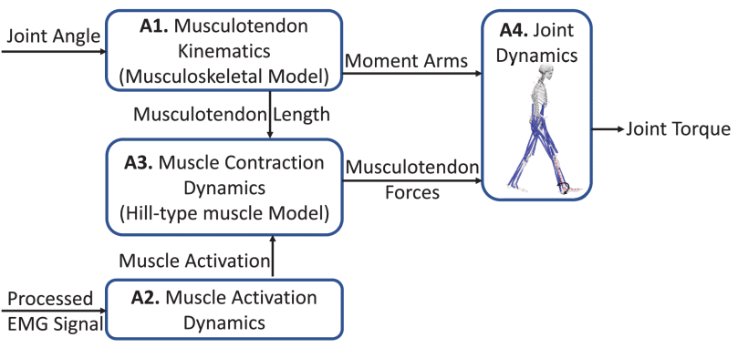
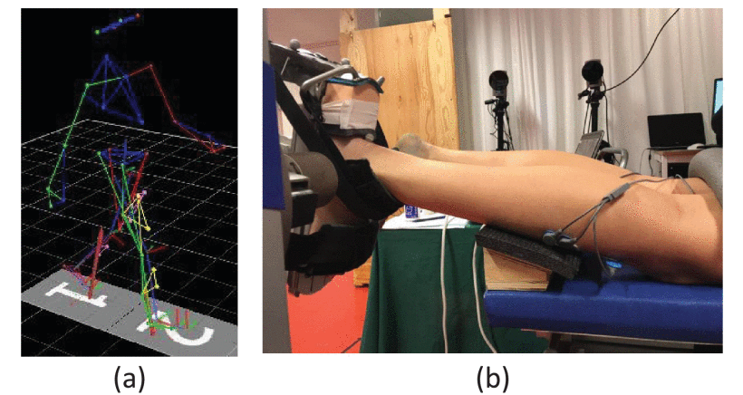
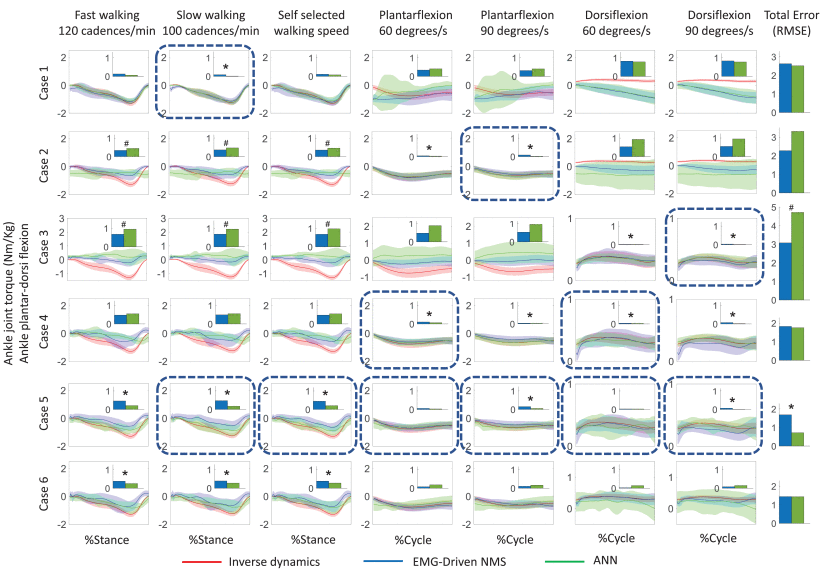

# 使用肌电图驱动的神经肌肉骨骼模型和人工神经网络模型估算踝关节力矩

## 基本信息

| Paper Title | Ankle Joint Torque Estimation Using an EMG-Driven Neuromusculoskeletal Model and an Artificial Neural Network Model |
| :---------: | :----------------------------------------------------------- |
|    日期     | 2022                                                         |
|    作者     | [Longbin Zhang](https://ieeexplore.ieee.org/author/37088232279) 瑞典斯德哥尔摩皇家理工学院 |
|    状态     | 已完成                                                       |
|    期刊     | [IEEE Transactions on Automation Science and Engineering](https://ieeexplore.ieee.org/xpl/RecentIssue.jsp?punumber=8856) |

## 摘要

> [!tip|style:flat|label:摘要] 
>
> 近几十年来，人们越来越关注使用机器人驱动的外骨骼来帮助康复和日常生活中的运动障碍患者。提供辅助扭矩以补偿用户剩余的肌肉贡献是外骨骼控制中一个不断增长且具有挑战性的领域。本文使用肌电图（EMG）驱动的神经肌肉骨骼（NMS）模型和人工神经网络（ANN）模型估计了7项运动任务的踝关节扭矩，包括快走，慢走，自选速度行走以及60 / s和90 / s的等动性背/跖屈。在每种方法中，均以**肌电信号和踝关节角**为输入，使用**三维运动分析数据**对模型进行训练，并预测踝关节扭矩。设计了6例不同运动试验作为校准（NMS模型）/训练（ANN），并计算了预测和测量踝关节扭矩之间的一致性。我们发现，**NMS模型总体上可以比ANN模型更好地从EMG和角度数据中预测踝关节扭矩**，但有一些例外；ANN预测了踝关节扭矩，当使用来自相同运动的数据进行训练时，具有更好的一致性。NMS模型在通过EMG达到最大水平的试验进行校准时预测踝关节扭矩最佳，而ANN在经过许多试验和运动类型的训练时预测良好。此外，在预测看不见的运动时，ANN预测可能会变得不那么可靠。预测踝关节扭矩的方法的详细比较研究对于确定外骨骼控制策略至关重要。

## 创新点

- ?>  同时使用肌电驱动的NMS模型和ANN模型来估计踝关节扭矩。

- ?> 神经网络的方法貌似并没有更好的效果。
- ?> 只有背伸和跖屈被检验。

## 思维导图

## 重点内容

### 背景介绍

> ?>患者要积极参与康复训练很重要-->基于参考轨迹的控制策略不具有特异性-->提出要建立基于患者肌肉能力的外骨骼控制策略-->ANN的方法可能会更加方便

> [!Note|style:flat|label:引言] 
>
> 神经系统疾病引起的身体变化，例如肌肉无力、协调性差和感觉丧失，会影响日常活动，例如大量人群的运动[1]。运动康复一直是运动障碍患者的关键优先事项[2]。例如，已经开发出用于恢复脊髓损伤（SCI）和中风患者的运动功能并促进运动康复的设备。一个这样的设备是有动力的外骨骼[3]，[4]。在外骨骼辅助康复期间，患者的积极参与对于促进神经肌肉恢复至关重要[5]。然而，尽管机电一体化和生物电的发展，涉及使神经受影响患者积极参与的外骨骼控制方法仍然很少，这限制了诱导活动驱动的神经可塑性改变的可能性，而这是恢复[6]所需要的。
>
> 在外骨骼辅助康复训练期间，已经设计了许多控制算法来增加患者的肌肉力量，大脑可塑性和运动增强[7]。Neuhaus等人[8]提出了一种机器人矫形器“Mina”，用于使用截瘫患者身体健全的个体的记录角度轨迹来辅助移动。Farris等人[9]提出了一种电动下肢矫形器，它可以根据身体健全的受试者的关节角度轨迹，在步态SCI患者的髋关节和膝关节的矢状平面上提供辅助扭矩。然而，这些控制算法使用为整个步态周期预定义的参考轨迹。**预定义的轨迹不利于身体的自然运动**，也不考虑人体肌肉的协调方式。此外，个体适应是非常困难的，因为不可能将运动轨迹从一种步态模式平稳地转移到另一种步态模式。因此，设计能够**实现用户意图而不是参考轨迹的外骨骼控制算法**是非常需要的。
>
> 根据用户的意图设计外骨骼控制算法需要准确而强大的**运动功能解码**(decoding of motor function)，例如，通过记录潜在的神经肌肉活动，例如来自中枢神经系统（CNS）的大脑，神经和肌肉肌电图（EMG）信号[10]-[13]。**与大脑和神经信号相比，肌电图信号相对容易获取和处理，并提供有关人体运动的基本信息**。肌电图信号与肌肉力量和关节扭矩**呈非线性关系**[14]。需要一个模型来**将肌肉激活和关节扭矩**联系起来，例如，具有改良的希尔型肌肉模型的神经肌肉骨骼（NMS）模型已被广泛使用[15]，[16]。基于EMG的建模也被集成到外骨骼执行器的各种人机控制策略中。Yao等人[5]利用EMG驱动的肌肉骨骼模型，提出了一种踝关节外骨骼的**自适应导纳控制方案**，并在8名身体健全的受试者身上进行了测试。他们能够根据踝关节的实时刚度估计实现顺应的关节辅助。Durandau等人[6]开发了一种具有EMG信号的患者**特异性计算NMS模型**，以控制下肢外骨骼，该外骨骼帮助患者进行麻痹，导致肌肉激活减少，并且需要生理扭矩来执行运动任务，并增加外骨骼辅助水平。Ronsse等人[17]使用**自适应振荡器**引入了基于身体健全的受试者关节位置的速度和加速度的实时估计，该振荡器可以用作**基于阻抗**的步行辅助策略。Karavas等人[18]提出了一种用于膝关节外骨骼的新型远程阻抗(teleimpedance)控制器，该控制器根据**用户的意图和关节刚度**为身体健全的受试者提供帮助。扩大这些研究以开发**基于患者神经肌肉能力的外骨骼控制器**具有明显的价值，同时考虑到涉及生物力学和神经生理学方面的复杂动力学。因此，**构建EMG驱动的NMS模型来预测用户的生理转矩**对于设计外骨骼控制策略具有重要意义。
>
> 近年来，人工神经网络（ANN）技术在分类、预测、识别和优化问题中得到了广泛的应用[19]-[22]，并在现代社会的许多领域展示了力量，如市场营销、农业和医疗保健[23]。传统的外**骨骼辅助策略的肌电控制策略需要精心构建和选择特征**。例如，**EMG驱动的NMS模型由复杂的校准程序组成**，需要在不同的变量之间构建复杂的关系，例如**肌电信号，肌肉几何形状，运动数据和关节扭矩**。或者，ANN模型可以提取多个表示级别上的特征，并通过足够多的表示层组成来预测非常复杂的函数，而无需显式描述变量之间的复杂关系。ANN方法已被应用于估计垂直跳跃[24]，等速膝关节收缩[25]和肘部屈曲运动[26]期间的下肢关节扭矩。因此，ANN是使用肌电图驱动的NMS模型将肌电图信号映射到关节扭矩的可能替代方案。

### 获取关节扭矩-步态

> ?>MOtoNMS可以产生Opensim的输入数据。Opensim可以计算关节角度和扭矩。根据[文档](https://simtk.org/projects/motonms)，MOtoNMS主要处理C3D文件。

> [!Note] 
>
> 根据欧洲推荐的表面肌电信号，在右腿比目鱼肌(SOL)、胫骨前肌(TA)和腓肠肌内侧肌(GM)上放置表面肌电电极[27]。使用3-D运动捕捉系统(Qualisys)来记录放置在对象上的标记的轨迹[28]，[29]。实验包括步态分析和踝关节等速背部/足底屈曲测试。受试者被要求首先以自己选择的速度行走，然后以每分钟120和100节奏/分钟的速度与节拍器同步三次。地面反作用力(GRF)由两个测力板(Kistler)测量。
>
> 在[**MOtoNMS工具箱**](https://github.com/RehabEngGroup/MOtoNMS)[33]中执行标记轨迹、地面反作用力(GRF)和EMG数据处理，该工具箱处理来自不同运动捕捉系统中的C3D文件的实验数据，包括标记轨迹、GRF和EMG数据，并为NMS建模软件(OpenSim)产生输入数据。**关节角度和扭矩在开源肌肉骨骼建模软件(OpenSim)中计算**。使用标记轨迹对通用肌肉骨骼模型(OpenSim gait 2354)进行缩放，以适合每个人的体格参数(individual’s anthropometry)。然后，通过求解反向运动学和逆动力学[30]，使用缩放模型根据动态运动过程中捕获的标记轨迹和GRF来重建3D关节角度和扭矩。反向运动学解决了加权最小二乘问题，以最小化实验之间的距离$x_{i}^{\text {exp}}$ 和模型上的相应标记$x_i$，如下所示 [34]：
> $$
> \min _{q} \left ({\sum _{i}^{N} \theta _{i} \|{x_{i}^{\text {exp}}-x_{i}}\|^{2}}\right) \tag{1}
> $$

 ### 获取关节扭矩-等速

 > ?>只有背伸跖屈被验证

 > [!Note] 
 >
 > 
 >
 > 在等速踝关节运动中，受试者以俯卧姿势躺着，右膝屈曲20°，右脚固定在与等速测力计相连的踏板上(IsoMed 2000)。同时记录踝关节角度和扭矩。每个受试者都被鼓励以最大的努力(effort)进行足底屈曲，同时踝关节进行足底屈曲，同样地，在足屈-20°和背屈15°的运动范围内，以60°和90°/s的速度连续5次背屈。
 > 
 > 在踝关节等速背屈任务中，以5000赫兹记录踝关节角度和扭矩，然后用截止频率为6赫兹的四阶巴特沃斯低通滤波器进行滤波。肌电信号的处理方式与步态相同。在MatLab中处理踝关节角度、扭矩和肌电数据。

 ### EMG驱动的骨骼肌肉模型

 > ?>这一部分介绍了典型的基于EMG的估计关节力矩的方法。

 > [!Note] 
 > 
 >
 > 肌电驱动的NMS模型示意图。该模型由四个部分组成:a1 -利用模型的**肌腱运动学**(musculotendon kinematics)计算肌肌腱长度和力臂；采用a2 -肌肉激活动力学计算处理后肌电信号中肌肉的激活水平；采用基于hill肌肉模型的a3 -**肌肉收缩动力学**模型，以计算出的肌肉肌腱长度和肌肉激活为输入，预测肌肉肌腱力；以计算得到的肌肌腱力和力矩臂为输入，使用a4关节动力学计算关节扭矩。
 >
 > 肌电驱动的NMS模型通过校准的肌电信息NMS建模工具箱(calibrated EMG-informed NMS modeling,CEINMS)[15]在OpenSim中实现。OpenSim还被用来通过比例缩放的肌肉骨骼模型使用关节角度来计算肌腱长度和力矩臂[39]。CEINMS随后被用来校准特定于受试者的肌电驱动的NMS模型以预测关节扭矩。
 >
 > 肌电驱动的NMS模型的详细参数配置遵循Pizzolato等人的建议[15]。在校准过程中，这些特定于对象的参数通过优化算法进行了优化，以最小化估计和测量/实际踝关节扭矩之间的误差。

  ### 评价方法

 > ?>存在问题：使用那一部分数据进行的验证？其余的实验(the remaining trials)指的是什么？怎样确保模型在一个新的case里面进行验证？

 > [!Note] 
 >
 > 为了研究并比较通过EMG驱动的NMS模型和ANN预测踝关节扭矩的效率和准确性，形成了6个不同的案例，使用不同类型的试验来校准（NMS模型）或训练（ANN）模型。经过校准（训练），得到NMS模型的参数，包括每个**MTU的最优纤维长度**和**肌腱松弛长度**，肌肉活化动力学参数和**最大等距力**;还获得了ANN模型的参数，包括隐藏层神经元，学习速率，批大小，初始值设定项和纪元(epochs)数。**然后，每个经过校准和训练的模型都在其余的试验中进行测试。**选择六种不同的情况来验证所提出的假设，即ANN模型将比EMG驱动的NMS模型具有更好的整体性能，但是当在**涉及相同肌肉收缩的运动上**进行校准和测试时，EMG驱动的NMS可能具有更好的一致性。
 >
 > - 以100次/分钟的速度慢走三次。
 > - 以90°/s的速度进行3次等速屈足试验。
 > - 以90°/s的速度进行三次背屈试验。
 > - 背屈3次，60°/s，掌屈3次，60°/s。
 > - 分别以100次/min的慢走、60°/s的背屈、90°/s的背屈、60°/s的足屈和90°/s的足屈进行两次实验。
 > - 包括最大信号处理(maximum signal processed)肌电幅度的三个试验涉及SOL、GM和TA肌肉的所有试验。

 ### 结果分析

 > ?>核心观点与说明

 > [!Note] 
 >
 > 
 >
 > - 然而，训练有素的EMG驱动的NMS模型总体上比ANN更好地预测了踝关节扭矩，在肌肉收缩与校准运动相似的运动中。
 > - 在步态和等速足底屈曲中，SOL和GM都作为运动的主要肌肉，并且可能具有相似的肌肉协调模式。
 > - 在大量试验中进行校准通常并没有改善NMS在预测关节扭矩方面的性能，但确实提高了ANN的性能。
 > - 在肌电图驱动的NMS模型中，在校准过程中明确考虑了相对时间和相对大小[47]、[48]的肌肉协调性，因此，如果看不见的运动具有相似的肌肉协调模式，EMG驱动的NMS模型将更好地工作。
 > - 受试者指定的EMG驱动模型通过个性化的肌肉骨骼几何形状（如力矩臂和肌肉特征)进行校准，可以提高其在关节扭矩预测中的可靠性。然而，EMG驱动的NMS模型由复杂的校准程序组成，并且需要构建不同变量之间的复杂关系，例如EMG信号，肌肉几何形状，运动数据和关节扭矩。
 > - ANN可用于映射输入和输出之间的关系，但它不能解释网络的行为，从而降低其在网络中的可靠性。

## 参考文献

L. Zhang, Z. Li, Y. Hu, C. Smith, E. M. G. Farewik and R. Wang, "Ankle Joint Torque Estimation Using an EMG-Driven Neuromusculoskeletal Model and an Artificial Neural Network Model," in IEEE Transactions on Automation Science and Engineering, vol. 18, no. 2, pp. 564-573, April 2021, doi: 10.1109/TASE.2020.3033664.
