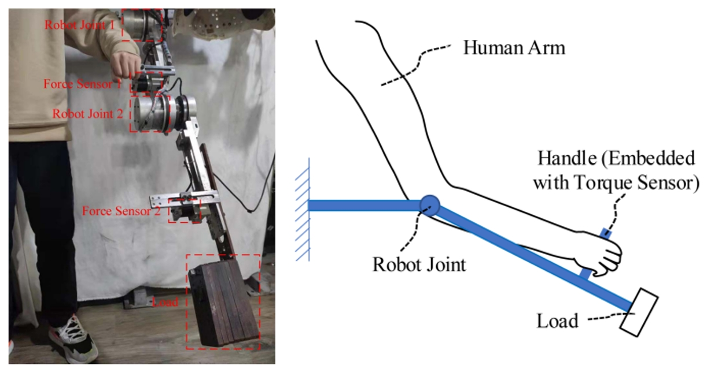
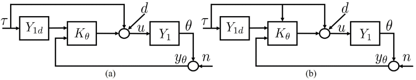
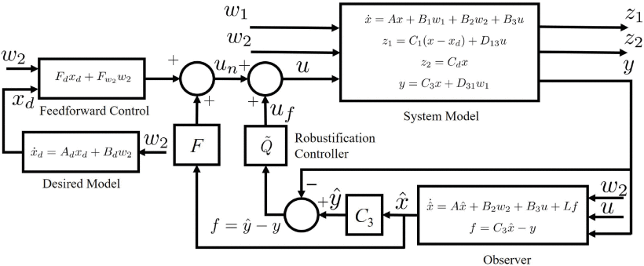
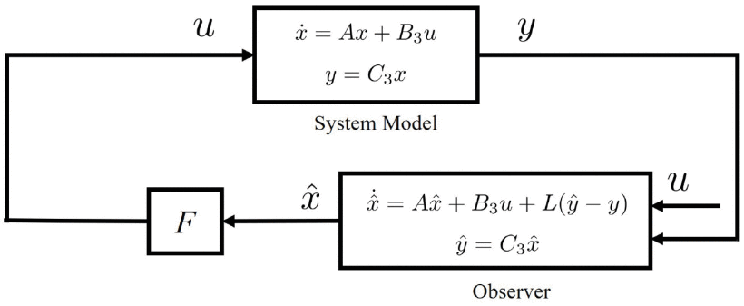

# **具有互补无源性的鲁棒导纳控制**

## 基本信息

| Paper Title | Robust Admittance Control With Complementary Passivity |
| :---------- | ------------------------------------------------------ |
| 年份        | 2023                                                   |
| 作者        | Jiapeng Xu 加拿大温莎温莎大学电气与计算机工程系        |
| 状态        | 待开始                                                 |
| 期刊        | IEEE Robotics and Automation Letters                   |

## 摘要

> [!tip|style:flat|label:摘要] 
>
>  本文研究了一个稳定和不稳定线性时不变系统的具有无源性要求的鲁棒导纳控制问题，其动机是由物理人机交互引起的控制问题。提出并分析了一种互补导纳控制结构，表明其标称性能(nominal performance)(导纳跟踪和无源性)与鲁棒性解耦。对具有无源要求的人体手臂增力的导纳控制进行了仿真，验证了控制器设计的有效性。

## 创新点

## 思维导图

## 重点内容

### 背景介绍

> ?>核心观点与说明

> [!Note] 
>
>导纳/阻抗控制是一种广泛用于交互系统的控制方法，例如物理人机交互和涉及与环境交互的机器人系统[1]，[2]，[3]，[4]。它已被应用于解决各种应用中的导纳/阻抗跟踪问题(tracking problems)，例如，增力(force augmentation)外骨骼机器人[4]、[5]、[6]、机器人辅助康复[7]、工业机械手[8]、[9]和电动助力转向系统[10]。参考文献[3]对导纳控制的发展和应用进行了全面综述。
>
> 与经典的伺服控制问题不同，(经典的伺服控制问题的目标是命令跟随(command following)和干扰抑制或衰减)，导纳控制作为一种交互控制方法，通常对耦合稳定性(coupled stability)有额外的要求[11]，注意到耦合稳定性允许极点在虚轴上[11]。如[11]所示，如果机器人被设计为像无源系统一样工作，则可以保证机器人与任何无源环境之间的耦合稳定性。因此，在导纳控制器的设计中，通常要求特定输入输出通道(channel)的受控系统是无源的，以确保耦合稳定性或安全的人机交互。时域和频域方法都已被研究用于基于无源性的控制器设计，例如，通过使用正实条件，时域中的[12]、[13]、[14]和频域中的[2]、[11]、[15]、[16]。
>
> 除了导纳跟踪性能和无源性要求外，人们还认识到，对模型不确定性和外部扰动的鲁棒性也是导纳控制器设计中的一个关键性能指标[3]，[11]，[15]。然而，大多数现有工作要么考虑无源性[2]、[11]、[12]、[13]、[14]、[15]、[16]，要么只考虑鲁棒性[5]、[8]、[17]。[15]中提出了一种用于交互控制的传递函数方法。虽然无源性和干扰衰减被分别处理，但必须假设一个稳定的对象(stable plant)，并且鲁棒性问题实际上没有得到很好的探讨。在[18]中，提出了一种多目标控制综合方法，其中所有目标都用共同的李亚普诺夫函数表示(formulated)。然而，值得注意的是，这种设计策略本质上引入了保守性(conservatism)。因此，需要开发一种有效的导纳控制器设计方法，同时考虑无源性要求和鲁棒性能。
>
> 我们深入研究了人机交互系统领域，并重点研究了线性时不变(linear time-invariant,LTI)系统的鲁棒导纳控制问题，无论它们是稳定的还是不稳定的。我们的主要目标是在状态空间公式中设计一种导纳控制器，该控制器在不影响标称性能(导纳跟踪和无源性)的情况下实现H∞性能[注：标称性能代表了标称系统在导纳和无源性方面的目标性能(target performance)]。特别是，通过利用[19]中的控制框架，提出并证明了一种鲁棒导纳控制器可以实现互补标称性能，即,当不确定性消失时，恢复关于特定输入输出通道的标称导纳跟踪性能和无源性。值得注意的是，我们的结果(定理2)证明了通过采用[19]中的控制结构，标称性能(导纳跟踪和无源性)与鲁棒性解耦。
>

### 系统的无源性

> ?>核心观点与说明
>

> [!Note] 
> 具有输入-输出对$(h,g)$的系统是无源的，其中$h(t)$和$g(t)$是相同维度的向量，如果存在非正常数$\alpha$，使得
>
> $$\begin{equation*} \int _{0}^{t} h^{\prime }(\tau)g(\tau)\ge \alpha\tag{1}\end{equation*}$$
>
> 对于所有函数$h$和所有$t>0$。无源性的物理意义是无源系统不能输出比其输入能量更多的能量。
>
> 

### 状态空间数据的传递矩阵

> ?>核心观点与说明

> [!Note] 
> 集合$\mathbb {R}^{n}$由所有$n$维实向量组成，其中 $\mathbb {R} \mathrel {\mathrel {\mathop:}}=\mathbb {R}^{1}$。正定(半正定)由$X$表示，$X>0 (X\ge 0)$，对于实矩阵或向量$Y$，其转置由$Y′$表示。平方矩阵的谱半径用$\rho (\cdot)$表示。设$\|T(s)\|_{2}$和$\|T(s)\|_{\infty }$表示传递函数或矩阵$T(s)$的$H_2$和$H_\infty$范数。状态空间数据的传递矩阵简单地表示为
>
> $$\begin{aligned} \left [{\begin{array}{c|c} A & B \\ \hline C & D \end{array}}\right] \mathrel {\mathrel {\mathop:}=} C(sI-A)^{-1}B+D \end{aligned}$$
> 

### 依托问题示例

> ?>核心观点与说明

> [!Note] 
>
> 
>
> 这个例子来自于人体手臂力量增强的导纳控制[4]。在这个例子中，人类可以在机器人的帮助下举起重物（如上图所示)。机器人的线性化模型为：
> $$\begin{equation*} m\ddot \theta +b\dot \theta +k\theta =u+d+\tau \tag{2}\end{equation*}$$
> 其中$\theta$是关节角，$\tau$是人机交互力，$u$是控制输入，$d$是表示建模不确定性的扰动，包括添加的未知载荷的重力项和其他不确定性。这里，$m$、$b$和$k$分别是机器人的机械惯性、阻尼和刚度。存在具有测量噪声$n$，即
>
> $$\begin{equation*} y_{\theta }=\theta +n \tag{3}\end{equation*}$$
>
> 在没有测量噪声的情况下，导纳模型用于表征速度$\dot \theta$和相互作用力$\tau$之间的动态关系[2]，即，
>
> $$\begin{equation*} Y_{2}(s)=\frac {s\theta (s)}{\tau (s)}=sY_{1}(s),\; Y_{1}(s)=\frac {1}{ms^{2}+bs+k}.\tag{4}\end{equation*}$$
>
> 导纳控制器旨在使机器人的固有导纳$Y_2$与期望的导纳相匹配，其特征在于以下无源模型：
>
> $$\begin{equation*} Y_{2d}(s)=\frac {s\theta _{d}(s)}{\tau (s)}=sY_{1d}(s),\; Y_{1d}(s)=\frac {1}{m_{d}s^{2}+b_{d}s+k_{d}},\tag{5}\end{equation*}$$
>
> 其中$\theta _{d}$是所需位置，$m_d$、$b_d$和$k_d$分别是所需惯性、阻尼和刚度。
>
> 
>
> 为了保证稳定/安全的人机交互，从$\tau$到$\dot \theta$的闭环导纳要求是无源的。在先前的研究中，已经提出了两种控制方案来实现期望的导纳行为。一个是位置控制器$K_\theta$，如上图a所示。$K_\theta$的形式可以是PD控制器。另一种方案是添加力前馈项，以在无源约束的情况下实现更好的导纳跟踪性能[3]，如上图b。力前馈定律经常用于导纳控制器的设计，例如参见[2]、[3]、[4]、[15]、[16]及其参考文献。当加入干扰或噪声时，应同时考虑跟踪性能、对干扰的鲁棒性和所需的无源性。在这项工作中，[19]中提出的设计框架将适用于导纳控制的鲁棒设计，以解决这些问题。
>
> 

### 依托问题的状态空间表述

> ?>核心观点与说明

> [!Note] 
> 受机器人模型(2)和(3)的启发，使用广义状态空间模型来描述受控系统：
> $$\begin{align*} \dot x=&Ax + B_{1}w_{1} + B_{2}w_{2} + B_{3}u, \\ y=&C_{3}x+D_{31}w_{1},\tag{6}\end{align*}$$
>
> 其中，$x\in \mathbb {R}^{n}$，$u\in \mathbb {R}^{m}$和$y\in \mathbb {R}^{p}$分别是状态、控制输入和测量输出，$w_{1}\in \mathbb {R}^{q_{1}}$是未知的外部扰动信号，$w_{2}\in \mathbb {R}^{q_{2}}$是已知(测量/估计)的外部信号，如人类机器人系统中的相互作用力$\tau$。所有矩阵都具有相容的维数(compatible dimensions)，并且$R_{3} \mathrel {\mathrel {\mathop:}=} D_{31}D_{31}^{\prime }>0$。以下是LTI系统控制器设计中的一个固定假设(standing assumption)，形式为(6)。
>
> **假设1**：$(A,B3)$是稳定的，$(C3,A)$是可检测的。
>
> 这项工作的控制目标是跟踪期望状态$x_d$，并实现来自广义期望导纳模型(generalized desired admittance model)的期望性能，该模型具有以下形式：
>
> $$\begin{align*} \dot x_{d}=&A_{d}x_{d}+B_{d}w_{2},\;\; x_{d}(0)=x_{d0} \\ y_{d}=&C_{d}x_{d}\tag{7}\end{align*}$$
>
> 其中$x_{d}\in \mathbb {R}^{n}$是对应于该给定输出参考$y_{d}\in \mathbb {R}^{q_{2}}$的期望状态。在人机交互示例中，所需输出满足$y_{d}=\dot \theta _{d}$。
>
> 下面的引理提供了一个必要和充分的条件，以确保稳定LTI系统在频域中的无源性。
>
> **引理1**：具有有理平方转移矩阵(rational square transfer matrix)$G(s)$的稳定LTI系统是无源的，其中$G$的所有极点都具有负实部，当且仅当
>
> $$\begin{equation*} G(j\omega)+G^{\prime }(-j\omega)\ge 0,\; \forall \omega \in \mathbb {R}.\tag{8}\end{equation*}$$
>
> 为了应用上述引理，做出了以下假设。
>
> **假设2**：$A_d$是Hurwitz矩阵，从$w_2$到$y_d$的导纳是无源的。
>
> **备注1**：如果所有参数$m_d$、$b_d$和$k_d$均为正，则**假设 2** 在人机交互示例中成立。$A_d$为Hurwitz矩阵的假设使得从输入$w_2$到输出$z_2$的闭环系统稳定，使得($w_2$,$z_2$)上的无源性要求等价于引理1提供的频域条件。在$A_d$在虚轴上具有特征值的情况下，正实条件[21]足以保证无源性。
>
> 对于给定的任务（跟踪期望状态xd并满足无源性要求），我们可以定义两个受控输出：
>
> $$\begin{align*} z_{1}\mathrel {\mathrel {\mathop:}=}&C_{1}(x-x_{d})+D_{13}u, \tag{9}\\ z_{2}\mathrel {\mathrel {\mathop:}=}&C_{d}x, \tag{10}\end{align*}$$
>
> 其中$z_{1}\in \mathbb {R}^{q_{3}}$用于优化导纳跟踪误差$x−x_d$并惩罚控制效果(penalize control effort)，而$z_{2}\in \mathbb {R}^{q_{2}}$被定义为无源，要求从$w_2$到$z_2$的闭环系统是无源的。在人机交互示例中，$z_{2}=\dot \theta$。定义$R_{1} \mathrel {\mathrel {\mathop:}=} D_{13}^{\prime }D_{13}>0$。
>
> 设$T_{z_{1}w_{1}}(s)$、$T_{z_{1}w_{2}}(s)$和$T_{z_{2}w_{2}}(s)$分别表示从$w_1$到$z_1$、$w_2$到$z_1$和$w_2$到$z_2$的闭环传递矩阵。这封信的目的是设计一个导纳控制器，使得
>
> - **导纳跟踪**状态$x$可以跟踪期望的状态$x_d$，这可以通过优化$T_{z_{1}w_{2}}(s)$的某个范数(certain norm)来实现；
>
> - **无源性**从输入$w_2$到输出$z_2$的闭环系统是无源的，即引理1和假设2的$T_{z_{2}w_{2}}(j\omega)+T_{z_{2}w_{2}}^{\prime }(-j\omega)\ge 0,\; \forall \omega \in \mathbb {R}$；
>
> - **鲁棒性**满足$H_{\infty }$性能$\|T_{z_{1}w_{1}}(s)\|_{\infty } < \gamma$，其中$\gamma>0$是规定值(prescribed value)。
>
> **备注2**：尽管公式化问题的动机是物理人机交互的导纳控制，但它是某些LTI系统的遗传问题(genetic problem)，例如并网电压源变换器(grid-connected voltage source converters,VSCs)。
>
> 
>
> 
>

###  鲁棒导纳控制结构

> ?>核心观点与说明

> [!Note] 
>
> 受[19]中开发的新控制框架的启发，提出了一种鲁棒导纳控制结构，如图所示，其中控制律表示为
>
> $$\begin{align*} \dot {\hat x}=&A\hat x+B_{2}w_{2}+B_{3}u+L(C_{3}\hat x-y), \\ \dot x_{d}=&A_{d}x_{d}+B_{d}w_{2},\;\; x_{d}(0)=x_{d0}, \\ u_{n}=&F\hat x+F_{d}x_{d}+F_{w_{2}}w_{2}, \\ u_{f}=&\tilde Q(f),\; f=C_{3}\hat x-y, \\ u=&u_{n}+u_{f}.\tag{11}\end{align*}$$
>
> 控制输入$u$由两部分组成：1) 标称控制$u_n$满足标称设计目标，包括导纳跟踪性能和无源性要求，其特征是状态反馈和观测器增益$(F,L)$以及前馈增益$(F_d,F_{w2})$；2) 由残差信号$f$驱动的鲁棒控制器$\tilde Q$产生的鲁棒控制$u_f$。在给定标称控制$u_n$的情况下，$H_{\infty }$性能指标可以通过找到一个鲁棒控制器$\tilde Q$来获得。
>
> 
>

###  标称性能控制器的设计

> ?>核心观点与说明

> [!Note] 
> 实现目标(导纳跟踪和无源性)的标称性能控制器首先是为标称系统设计的，即没有$w_1$的系统(6)。在这里，我们从优化的角度提出了一个设计方案。
>
> 第一步是设计一个基于观测器的输出反馈稳定控制器，其特征为$(F,L)$，如图所示。有许多经典的方法来合成(synthesize)控制器增益，如极点配置和LQG/$H_2$控制。我们将采用一种常用的性能控制器：$H_2$最优控制器，它需要解决以下优化问题
>
> $$\begin{equation*} \min _{F, L} \|T_{z_{1}w_{1}}(s)\|_{2}.\tag{12}\end{equation*}$$
>
> 
>
>  为了应用Riccati方程方法来解决上述优化问题，需要以下假设[23]。
>  
>  假设3：(i)$\begin{aligned} \left [{\begin{array}{cc} A-j\omega I & B_{3} \\ C_{1} & D_{13} \end{array}}\right] \end{aligned}$对所有$\omega \in \mathbb {R}$具有全列秩，(ii)$\begin{aligned} \left [{\begin{array}{ccc} A-j\omega I & B_{1} \\ C_{3} & D_{31} \end{array}}\right] \end{aligned}$对所有$\omega \in \mathbb {R}$具有整行秩。
>  
>  假设3中的条件(i)相当于$((I-D_{13}R_{1}^{-1}D_{13}^{\prime })C_{1}, A-B_{3}R_{1}^{-1}D_{13}^{\prime }C_{1})$在虚轴上没有不可观测的模式[23]；条件(ii)有类似的解释。然后由$F=-R_{1}^{-1}(\Pi _{1} B_{3}+C_{1}^{\prime }D_{13})^{\prime }$和$L=-(\Pi _{2} C_{3}^{\prime }+B_{1}D_{31}^{\prime })R_{3}^{-1}$[23]给出解，其中$\Pi _{1}\ge 0$和$\Pi _{2}\ge 0$是以下两个代数Riccati方程的稳定解， 假设3：
>  
>  $$\begin{align*}&\Pi _{1} A+A^{\prime }\Pi _{1} -(\Pi _{1} B_{3}+C_{1}^{\prime }D_{13})R_{1}^{-1}(\Pi _{1} B_{3}+C_{1}^{\prime }D_{13})^{\prime } \\&\;\quad {}+ C_{1}^{\prime }C_{1}=0, \\&\Pi _{2}A^{\prime }+A\Pi _{2} -(\Pi _{2} C_{3}^{\prime }+B_{1}D_{31}^{\prime })R_{3}^{-1} (\Pi _{2} C_{3}^{\prime }+B_{1}D_{31}^{\prime })^{\prime } \\&\;\quad {}+B_{1}B_{1}^{\prime }=0.\tag{13}\end{align*}$$
>  
>  
>  
> 
>
> 

### 内容标题

> ?>核心观点与说明

> [!Note] 
> 

### 内容标题

> ?>核心观点与说明

> [!Note] 
> 

### 内容标题

> ?>核心观点与说明

> [!Note] 
> 

### 内容标题

> ?>核心观点与说明

> [!Note] 
> 

### 内容标题

> ?>核心观点与说明

> [!Note] 
> 

### 内容标题

> ?>核心观点与说明

> [!Note] 

## 参考文献
