# 动力学与Hill模型相结合用于功能性电刺激踝关节角度预测

## 基本信息

| Paper Title | Dynamics Combined With Hill Model for Functional Electrical Stimulation Ankle Angle Prediction |
| :---------- | ------------------------------------------------------------ |
| 年份        | 2023                                                         |
| 作者        | [Xianghong Zhang](https://ieeexplore.ieee.org/author/37088950313) 福州大学物理与信息工程学院 |
| 状态        | 完善中                                                       |
| 期刊        | [IEEE Journal of Biomedical and Health Informatics](https://ieeexplore.ieee.org/xpl/RecentIssue.jsp?punumber=6221020) |

## 摘要

> [!tip|style:flat|label:摘要] 
>
>  肌肉骨骼模型在踝关节康复研究中起着至关重要的作用。现有的大多数模型都建立了肌电与关节力矩之间的关系。然而，EMG信号采集需要更高的临床条件，例如对外部环境的敏感性、运动伪影和电极位置。为了解决**关节运动的非线性和时变性**，本研究提出了一种功能性电刺激（FES）模型来模拟踝关节背屈的整个过程。该模型与**基于Hill模型的肌肉收缩动力学**和**脚踝反向动力学**相结合，以连接FES参数、扭矩和脚踝角度。此外，应用**扩展卡尔曼滤波器**（EKF）算法对模型的未知参数进行识别。通过获取健康志愿者的实际数据进行模型验证实验。结果表明，该模型的均方根误差和归一化均方根误差分别为11.93%±0.53%和1.39°±0.26°，可以有效**预测电刺激参数变化时踝关节角度的输出变化**。因此，所提出的模式对于开发电刺激的闭环反馈控制至关重要，并有可能帮助患者进行康复训练。

## 创新点

 在本研究中，将所提出的FES模型与动力学相结合，以解决关节运动的非线性和时变性质。分析了**踝关节的运动学特性**，并基于Hill模型，利用**肌肉收缩动力学**建立了FES参数与踝关节力矩的关系。踝关节角度和力矩通过**拉格朗日逆动力学**联系起来。建立了**电刺激下踝关节角度模型的状态方程**。此外，应用**扩展卡尔曼滤波器**（EKF）算法通过识别模型中的未知参数来优化模型。最后，进行体内实验以获取实际数据，并将其与通过模型获得的预测数据进行比较。

## 重点内容

### 课题背景

> ?>功能性电刺激可以解决足下垂问题→要向功能性电刺激是有效的就要实现精确的刺激时间和强度控制→必须建立电刺激下的个体肌肉骨骼反应模型→骨骼肌肉模型是一个方法→但是该模型存在复杂性问题

> [!Note] 
>
>踝关节背屈障碍（也称为足下垂）患者的临床表现包括脚尖无法产生背屈或抬高[1]。这种情况的发生是由于抬脚肌肉的无力麻痹，可以通过一种名为功能性电刺激（FES）的技术解决方案来解决，这是目前治疗踝关节背屈障碍最有前途的康复技术[2]，[3]，[4]。FES包括向运动神经元传递一系列电流脉冲，以引发人工肌肉收缩。为了治疗足部下垂，FES被用来刺激胫骨肌肉，以诱导脚踝上的关节功能运动。
>
>FES的有效性取决于对**刺激时间**和**刺激强度**的精确控制[5]，[6]。因此，FES系统正从开环向闭环发展。FES闭环反馈控制解决了电刺激不足、刺激过度、肌肉疲劳等问题。目前许多闭环控制方法都是基于模型的控制，建立电刺激下关节力矩或角度的模型是研究FES控制系统的前提。然而，由于患者的疾病程度、阶段和残余肌肉力量不同，肌肉骨骼系统对电刺激的反应也呈现出各种特征。精确控制电刺激下的关节角度或力矩以实现关节功能运动是FES系统的一个具有挑战性的问题。因此，必须建立电刺激下的个体肌肉骨骼反应模型，通过应用准确的刺激时间和刺激强度来控制关节运动。
>
>肌肉骨骼建模广泛应用于肢体关节建模，主要基于Hill模型，建立**刺激信号、激活程度和肌肉输出力**之间的关系。Hill模型将激活状态转换为肌肉力，并使用运动学分析来获得关节扭矩，从而在肌肉激活量和关节运动信号之间建立联系。Hill模型已广泛应用于肢体关节的模型结构[7]，如腕关节[8]、肘关节[9]、踝关节[10]、膝关节[11]等。Yihui Zhao等人基于Hill模型和腕关节运动学，开发了肌电信号驱动的腕关节力矩模型。利用肌电信号驱动模型实现了手腕运动的连续估计，并展示了该模型的精确跟踪性能。Stanford Delap的研究小组[12]在Hill模型的基础上建立了神经生物力学系统的下肢模型。通过实验收集了模型所需的运动学信息、运动产生的肌电信号和接触力。利用人体关节动力学的逆运动学和正反向优化方法确定了模型参数。F.Romero等人[13]利用Hill模型建立了从膝关节力矩到电刺激幅度的反向模型，并根据实际刺激曲线调整了参数模型。渡边隆史等人[14]通过Hill模型建立了电刺激频率与肌肉力量之间的关系。他们的发现提高了在临床现场进行参数识别的效率。
>
>前面提到的研究表明，Hill肌骨模型在关节的复杂运动方面表现出了卓越的性能。但是，也存在以下问题：
>
> -  现有的基于Hill模型的关节模型研究大多建立了肌电和关节力矩之间的关系，但模型中的肌电变量和力矩变量观察起来很复杂。
> - 电刺激下的关节运动会导致肌肉疲劳和其他现象，从而导致肌肉骨骼模型的非线性和时变。此外，模型结构复杂，具有许多难以获得的参数。
>

### 踝关节肌肉力臂

> ?> 分析了力臂

> [!Note] 
>
>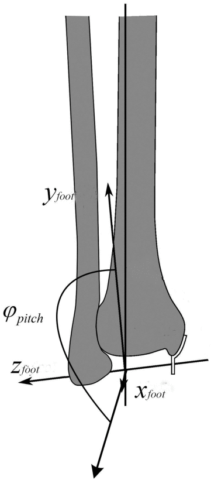
>
> 踝关节的局部足部坐标系[15]由右手规则建立，该规则相对于全局坐标系具有一定的倾斜角度，如图所示。围绕$z_{foot}$轴和角度$\varphi_{pitch}$的旋转是踝关节角度。
>
>
>
>
>上图（a）建立了踝关节肌肉的全局坐标系[15]。绿线是胫前肌（TA），蓝线是比目鱼肌（SOL），红线是腓肠肌（GAS）。TA是踝关节背屈的主要驱动因素。下表从上到下显示了TA线上四个点的初始位置，以及SOL和GAS肌线在跟骨后表面的交点的终点位置坐标[16]，[17]。踝关节背屈$\Delta \theta_{ankle}$ 角度的整个过程如上图(b)所示。将肌肉上的起点、终点和两块肌肉上垂直平分线的交点转换为坐标。变换后的坐标用全局上标表示。点$\hat{p}_{I,C}^{global}$是通过$\Delta \theta_{ankle}$路径的垂直平分线的交点。力臂计算是通过肌肉长度从施加的力到固定点的垂直距离得出的。因此，根据上图(a)和(b)，踝关节的力臂TA是点$\hat{p}_{I,C}^{global}$和线段$\hat{p}_{O,TA}^{global}$、$\hat{p}_{I,TA}^{global}$[15]之间的距离。距离公式用于计算力臂公式Eq.1。
>
>$$\begin{equation*} {\gamma _{ma,TA}} = \frac{{\left| {\left({\hat{p}_{I,C}^{global} - \hat{p}_{O,TA}^{global}} \right)\left({\hat{p}_{I,TA}^{global} - \hat{p}_{O,TA}^{global}} \right)} \right|}}{{\left| {\hat{p}_{I,TA}^{global} - \hat{p}_{O,TA}^{global}} \right|}}\ \tag{1} \end{equation*}$$
>
>| 参数                     | 描述           | 坐标                |
>| ------------------------ | -------------- | ------------------- |
> | $P_{O,TA}^{shank}$       | TA的起始点     | [-1.55,21.75,1.34]  |
> | $P_{O_{eff},TA}^{shank}$ | TA的小腿连接点 | [2.56,2.57,-0.93]   |
> | $P_{I_{eff},TA}^{foot}$  | TA的足连接点   | [7.57,-4.20,-1.96]  |
> | $P_{I,TA}^{foot}$        | TA的足终止点   | [18.50,-5.10,-3.30] |
> | $P_{I,SOL}^{foot}$       | SOL的足终止点  | [-3.65,-2.88,0.56]  |
> 
>这些计算结果由曲线拟合，如下图所示。
>
>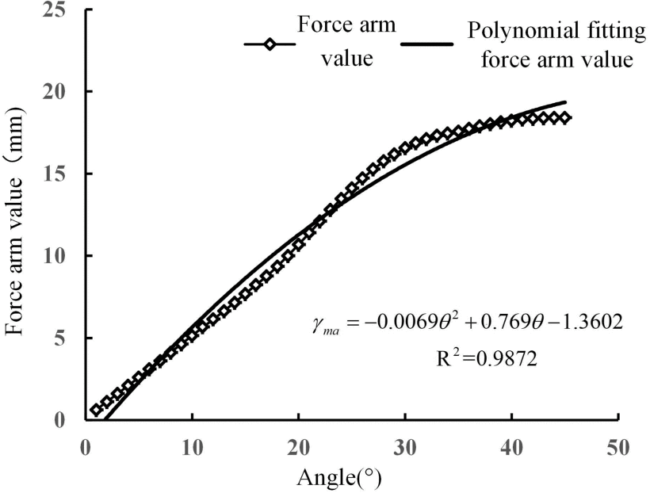
>
>根据拟合结果TA的力臂与踝关节角度之间的关系表示如下，
>
>$$\begin{equation*} {\gamma _{\text{ma}}} = - 0.0069{\theta ^2} + 0.769\theta - 1.3602 \tag{2} \end{equation*}$$
>
>此外，TA[18]的总肌肉长度$l_{MT,TA}$如Eq.3所示计算，并带入相关坐标中。
>
>$$\begin{equation*} l_{MT,TA}^{} = p_{Ieff,TA}^{foot} - p_{I,TA}^{global} + p_{Oeff,TA}^{shank} - p_{O,TA}^{global} \tag{3} \end{equation*}$$
>
>TA速度可以用Eq.4计算，
>
>$$\begin{equation*} {v_M} = \frac{{d{l_M}}}{{dt}} = \dot{\theta }\frac{{d{l_{MT}}}}{{d\theta }}\frac{1}{{\cos {\alpha _P}}} \tag{4} \end{equation*}$$
>
>其中$l_{MT}$是肌腱加上肌肉纤维的长度。$\alpha_P$是羽化角，位于肌肉纤维和肌腱之间。当羽化角大于0时，肌肉纤维被诱导产生肌肉力量，当羽化角度为90°时，肌纤维收缩达到最短。踝关节上TA的羽化角为9.6°[19]。
>

### 电刺激-肌肉激活模型

> ?>这一部分阐释了电刺激生成肌肉激活的过程模型。

> [!Note] 
>
>电刺激从激发到激活的过程可以由静态非线性（电刺激强度$Q_1(pw)$和频率$Q_2(f)$）和动态线性（微分方程）[13]组成，如Eq.5所示，
>
>$$\begin{equation*} \frac{1}{{{c_0}}}\dot{q}(t) + q(t) + {c_1} = {Q_1}(pw){Q_2}(f) \tag{5} \end{equation*}$$
>
>其中$c_0$的值为13.2[20]。$c_1$的值与不同个体的FES强度阈值有关，并将在本文稍后使用EKF算法进行识别。当电刺激强度较低时，肌肉可以感觉到，但不会产生收缩。然后，随着强度的增加，肌肉开始收缩，身体可能会出现刺痛感，并伴有肌肉痉挛和肌肉疲劳[21]。 因此，可以根据该原理绘制$Q_1(pw)$的曲线，如Eq.6所示。
>
>$$\begin{equation*} {Q_1}(pw) = \left\{ {\begin{array}{lcc} 0&{pw < p{w_{thr}}}&{}\\ {\frac{{pw - p{w_{thr}}}}{{p{w_{sat}} - p{w_{thr}}}}}&{p{w_{thr}} \leq pw \leq p{w_{sat}}}&{}\\ 1&{pw > p{w_{sat}}}&{} \end{array}} \right. \tag{6} \end{equation*}$$
>
>$Pw_{thr}$是踝关节背屈开始时的脉冲宽度，$Pw_{sat}$是最大角度处的脉冲宽度。$Q_2(f)$可以用非线性Eq.7[22]表示
>
>$$\begin{equation*} {Q_2}(f) = \frac{{{a_1} - {a_2}}}{{1 + {e^{(f - {f_0})/R}}}} + {a_2} \tag{7} \end{equation*}$$
>
>$a_1$、$a_2$和$f_0$表示激活时间参数，$f$表示电刺激频率，其中$a_1$由$a_2$计算，$a_2$是最大肌肉力量和临界融合频率的比值。（${a_1} = - {a_2}{e^{{f_0}/R}}$，${f_0} = R \cdot \ln [ {({{a_2} - 1}) \cdot {e^{{f_{CF}}/R}} - {a_2}} ]$，${a_2} = {F_{max}}/{f_{CF}}$）。取$R=15$[14]，$a_2=2.5$，$a_1=0.8323$。

### Hill 模型(sEMG-Force 模型)

> ?>给出了Hill模型的详细公式，但是其中的参数只有TA。

> [!Note] 
>
>Hill模型由三部分组成，如下图所示。它主要由平行弹性元件（PEE）、串联弹性元件（SEE）和收缩元件（CE）组成[23\]。lT，而lM表示肌肉纤维的长度。
>
>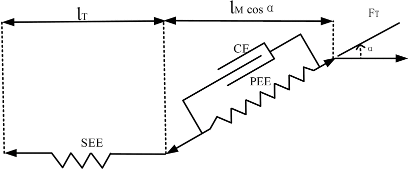
>
>肌肉收缩原理表明，由激活信号$q(s,f)$驱动的肌肉纤维的主动收缩被触发。产生的主动力与肌肉长度、肌肉收缩速度和激活量有关[24]，如下Eq.8
>
>$$\begin{equation*} {\bar{F}_{CE}} = \bar{F}*q(s,f){\tilde{F}_{Fl}}({l_M}){\tilde{F}_{F{v}}}({{v}_{{M}}}) \tag{8} \end{equation*}$$
>
>$$\begin{align*} &{\tilde{F}_{\mathrm{F}l}}\left({{l_{\mathrm{M}}}} \right)\ = {\rm{\ exp}}\left[ { - 40{{\left({{{\bar{l}}_{\mathrm{M}}} - 0.95} \right)}^4} + {{\left({{{\bar{l}}_{\mathrm{M}}} - 0.95} \right)}^2}} \right] \tag{9}\\ &{\tilde{F}_{\mathrm{F}v}}\left({{v_{\mathrm{M}}}} \right) = 0.54\arctan (5.69{\bar{v}_M} + 0.51) + 0.745 \tag{10} \end{align*}$$
>
>其中，$\bar{F}$代表标准化的静态力，即30N。力和长度之间的关系表示为指数函数，如Eq.9[30]所示。$l_M$表示肌肉纤维的长度。标准人体TA长度为6.8厘米[25]。$\bar{l}_M=l_m/l_{opt}$是肌肉的归一化长度，其中$l_{opt}=0.15m$[23]。
>
>肌肉输出力和速度之间的关系可以表示为Eq.10[7]，其中${\bar{v}_M} = {v_M}/{v_{Max}}$，$v_{Max}$是最大肌肉收缩速度，取2.5 m/s。
>
>SEE和PEE产生的力称为被动力。当肌纤维比静止长度长时，肌肉中结缔组织的粘性和弹性作用产生的被动力可以用Eq.11和Eq.12[7]、[30]表示，
>
>$$\begin{align*} &{F_{PE}}({L_M}) \\ &= \left\{\! {\begin{array}{l} 0\\ {F_0^M\arctan [{{(0.1({L_M} \!-\! {L_{PE,0}}) \!-\! 0.22)}^{10}}]} \end{array}\begin{array}{c} {{L_M} \!<\! {L_{PE}}_{,0}}\\ {{L_M} \!\ge\! {L_{PE,0}}} \end{array}} \right. \tag{11}\\ &{F_{SEE}}\ \left({{l_t}} \right) = \left\{ \begin{array}{lc} {0,}&{\forall {l_t} < {l_{SEE,0}}}\\ {{k_{SEE}}{{({l_t} - {l_{SEE,0}})}^2},}&{\forall {l_t} \geq {l_{SEE,0}}} \end{array}\right. \tag{12} \end{align*}$$
>
>其中，$F_0^M$是1.3，而$L_{PE,0}$是0.9。该力相当于串联弹簧，其中弹簧刚度系数$k_{SEE}$为36N/mm[26]。$l_{SEE,0}$在弛豫状态下为0.045m[23]。肌腱长度$l_t$通常为24.1cm，可以从肌腱长度与肌肉长度的比值中得出。
>
>该过程如下图中的框图所示。$\gamma _{ma}$表示作用在关节上的力臂，如Eq.2所示。$F^T$是通过Hill模型中TA肌肉的电刺激产生的力。两者的乘积产生主动转矩$\tau ^T$。
>
>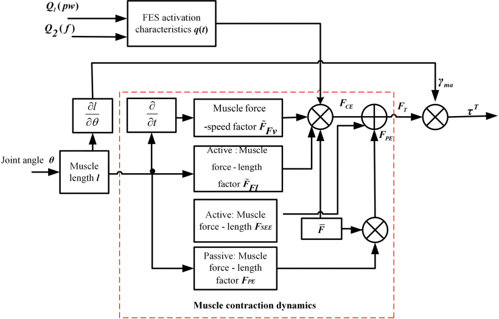
>
>通过对踝关节电刺激过程的Simulink仿真，得到了肌肉骨骼模型下踝关节力矩与踝关节角度和速度之间的关系。采用非线性最小二乘法对非线性曲面进行拟合。该过程被简化为以脚踝角度和角速度为自变量的多项式Eq.13，其参数${P_{00}}=110.9$，${P_{10}}=-35.9$，${P_{01}}=-4.7$。下图显示了电刺激下脚踝主动扭矩的模拟结果。
>
>$$\begin{equation*} {F_m}\left({v,\theta } \right)\ = \ {P_{00}}\ + \ {P_{10}}*v\ + \ {P_{01}}*\theta \tag{13} \end{equation*}$$
>
>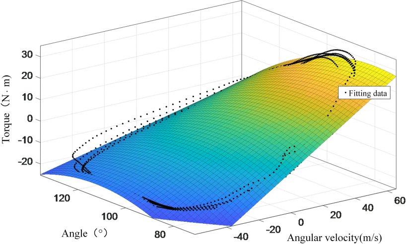
>
>运动过程中关节之间摩擦的影响被忽略。电刺激对肌肉的扭矩输入主要包括电刺激激活器产生的主动力$\tau ^T$[27]、肌肉的粘性力$\tau ^V$和弹性力$\tau ^E$。总转矩表示为Eq.14，每个分量表示为Eq.15。参数如下表所示。
>
>$$\begin{align*} &\tau = \tau _{}^T + \tau _{}^E + \tau _{}^V \tag{14}\\ &\left\{ \begin{array}{l} \tau _{}^T = {\gamma _{m{a_{}}}}F_{}^T\\ \tau _{}^E = {e^{{a_1}_{_k} + {b_{{1_k}}}x1}} - {e^{{a_2}_{_k} + {b_{{2_k}}}x1}} + c\\ \tau _{}^V = K{\mathop{\rm sgn}} (\dot{q})(d|\dot{q}|)^{n} \end{array} \right. \tag{15} \end{align*}$$
>
>| 参数  | $a_{1k}$ | $b_{1k}$ | $a_{2k}$ | $b_{2k}$ | $c$    | $K$  | $d$  | $n$   |
>| ----- | -------- | -------- | -------- | -------- | ------ | ---- | ---- | ----- |
>| Value | 2.1016   | -0.0843  | -7.9763  | 0.1949   | -1.792 | -1   | 0.1  | 0.099 |

###  踝关节逆动力学分析

> ?> 用踝关节逆动力学建立踝关节的角度、加速度和扭矩之间的关系，建立了状态方程。

> [!Note] 
>
>使用Lagrange函数和系统动力学方程进行计算。经过简化，脚背上涉及惯性矩和重力的作用项如下。
>
>$$\begin{equation*} {T_2} = {m_2}\ d_2^2{\ddot{\theta }_2} + {m_2}g{d_2}\sin {\theta _2} \tag{16} \end{equation*}$$
>
>其中$m_2$是脚的质量，$d_2$是脚踝和脚的质心之间的距离。根据不同的个体来确定参数$m_1$、$m_2$、$d_1$和$d_2$。
>肢体质量乘以相对转弯半径的平方是计算惯性力矩的常用方法，如Eq.17所示。
>$$\begin{equation*} J\ = {m_2}\ \ d_2^2 = \ \left({M \cdot \dot{m}} \right) \cdot {(l \cdot \dot{r})^2} \tag{17} \end{equation*}$$
>其中，$l$是脚的长度，$M$是志愿者的体重，$\bar{m}$表示脚的相对质量，男性为1.37%，女性为1.29%。$\bar{r}$表示旋转平面的平均相对半径，男性取纵向平面半径的13.9%作为$\bar{r}$，女性取12.4%[29]。因此，可以根据人体的不同质量和不同的关节长度来计算单个脚的惯性力矩和重力项。实验招募了四名志愿者。计算了它们的惯性、脚重和长度，如下表所示。
>
>| Subject | $J$(kg.m^2) | $M$(Kg) | $l$(m) |
>| ------- | ----------- | ------- | ------ |
>| 1       | 5.60e-4     | 52      | 0.25   |
>| 2       | 12.24e-4    | 66      | 0.27   |
>| 3       | 4.13e-4     | 43      | 0.22   |
>| 4       | 4.83e-4     | 46      | 0.23   |
>
>FES下踝关节肌肉骨骼模型的状态方程可以表示如下。$x=[x_1,x_2,x_3]'$表示状态变量，$x_1$和$x_2$表示踝关节的角度和角速度，$x_3$表示电刺激的激活。
>
>$$\begin{equation*} \begin{array}{l} {{\dot{x}}_1} = {x_2}\\ {{\dot{x}}_2} = \frac{1}{{{m_2}d_2^2}}({m_2}g{d_2}\sin {x_1} - {k_1}{e^{{k_2}x1}} + {\tau ^{\mathrm{T}}} + {\tau ^{\mathrm{E}}} + {\tau ^{\mathrm{V}}})\\ {{\dot{x}}_3} = {c_0}({\rm{ - }}{x_3} + {Q_1}(pw){Q_2}(f) + {k_3}) \end{array} \tag{18} \end{equation*}$$
>
>其中，${k_1}{e^{{k_2}x1}}$项是非线性部分。它代表了肌肉疲劳导致的生理表现的变化，以及建模过程中个体之间的差异。将使用EKF算法来识别参数$k=[k1,k2,k3]$。因此，肌肉骨骼模型的状态方程可以被获得为Eq.18。

### 识别模型参数的EKF算法

> ?>核心观点与说明

> [!Note]  将电刺激踝关节角度系统转换为状态方程和观测方程如下：
>
>$$\begin{align*} \frac{{dX(t)}}{{dt}} =& F(t,X(t)) + W(t) \tag{19}\\ y\left(t \right) =& CX\left(t \right) + V\left(t \right) \tag{20} \end{align*}$$
>
>其中，
>
>$$\begin{align*} F(t,X(t)) =& \left[ {\begin{array}{c} {f(X(t)}\\ 0 \end{array}} \right] \tag{21}\\ X(k) =& \left[ {\begin{array}{c} {x(k)}\\ {\theta (k)} \end{array}} \right] \tag{22} \end{align*}$$
>
>$V(t)$和$W(t)$是均值为零的无关高斯白噪声，它们的协方差矩阵分别为$Q(t)$与$R(t)$。函数$f(·)$表示从电刺激到肌肉激活的过程，$\theta(·)$是踝关节角度反应。$k$是离散时间，$x(k)$表示系统在$k$时刻的状态。$y(k)$代表相应时刻的观测值。
>
>EKF迭代过程如下：
>
>- 时间更新（预测），其中$t \in [t_{k-1},t_k]$
>
>
>状态时间更新：
>
>$$\begin{align*} &\frac{{d\hat{X}(t)}}{{dt}} = F(t,\hat{X}(t)) \tag{22}\\ &\hat{X}(k|k - 1)\ = \hat{X}\ \left({{t_k}} \right) \tag{23} \end{align*}$$
>
>误差协方差的时间更新：
>
>$$\begin{align*} \frac{{dP(t)}}{{dt}} =& \frac{{\partial F(t,\hat{X}(t))}}{{\partial \hat{X}}}P(t)\\ &+ P(t){\left(\frac{{\partial F(t,\hat{X}(t))}}{{\partial \hat{X}}}\right)^T} + Q(t) \tag{24}\\ &\qquad \qquad P(k|k - 1) = P\left({{t_k}} \right) \tag{25} \end{align*}$$
>
>- 测量更新（校正）
>
>
>计算卡尔曼增益矩阵：
>
>$$\begin{equation*} {K_k} = P(k|k - 1){C_k}^T{[{C_k}P(k|k - 1){C_k}^T + {R_k}]^{ - 1}} \tag{26} \end{equation*}$$
>
>用测量值更新估计值：
>
>$$\begin{equation*} \hat{X}(k|k) = \hat{X}(k|k - 1) + K{}_k[y(k) - {C_k}\hat{X}(k|k - 1)] \tag{27} \end{equation*}$$
>
>误差协方差更新：
>
>$$\begin{equation*} P(k|k)\ = \ \left({I - {K_k}{C_k}} \right)P(k|k - 1) \tag{28} \end{equation*}$$
>
>在Matlab中，求解Jacobian矩阵：
>
>$$\begin{equation*} \frac{{\partial F(t,X(t))}}{{\partial X}} = \left[ {\begin{array}{cc} {\frac{{\partial f(x(t))}}{{\partial x}}}&{\frac{{\partial f(x(t))}}{{\partial \theta }}}\\ 0&0 \end{array}} \right] \tag{29} \end{equation*}$$
>
>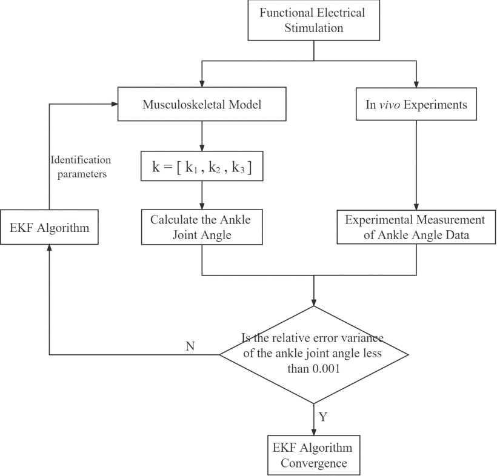
>
>假设采样点的个数为$N$，具体迭代过程如下：当$k=0$时，初始值设置为$X({00}) = E[X(0)] = {X_0}$，$P({00}) = E[(X(0) - {X_0}){(X(0) - {X_0})^T}] = {P_{X_0}}$。迭代收敛过程如上图所示。

### 踝关节动力学模型

> ?>这一部分建立了踝关节单自由度的动力学模型

> [!Note]
>拉格朗日建模方法通过计算踝关节的动能和势能，建立了运动系统与广义力之间的耦合关系。反向动力学使用关节力矩来反向运动学参数，从而建立踝关节的力矩、角度和加速度之间的关系。
>
>拉格朗日函数L定义为系统的动能K和势能P之间的差，如公式Eq.30所示。
>
>$$\begin{equation*} L\ = \ K - P \tag{30} \end{equation*}$$
>
>系统动力学方程可以从Eq.31中获得。 
>
>$$\begin{equation*} {F_i}/{\tau _i} = \frac{d}{{dt}}\frac{{\partial L}}{{\partial {{\dot{q}}_i}}} - \frac{{\partial L}}{{\partial {q_i}}} \tag{31} \end{equation*}$$
>
>$q_i$是系统的坐标变量，${F_i}/{\tau _i}$是相应的力或力矩，这取决于$q_i$是线性的还是角度的。如果$q_i$是线性位移坐标，则对应的${F_i}/{\tau _i}$是广义力，否则是广义力矩。
>
>在肌肉骨骼建模中，不考虑肌肉运动。肌肉只提供骨骼的驱动力。肌肉和骨头相当于一个身体。大腿是固定的，腿和脚相当于两个刚性杆结构，如下图所示。建立$x-y$广义坐标并分析矢状平面的运动。让小腿长度为$l_1$，脚长度为$l_2$，并使用$d_1$，$d_2$分别表示从两个杆端到质心的距离。
>
>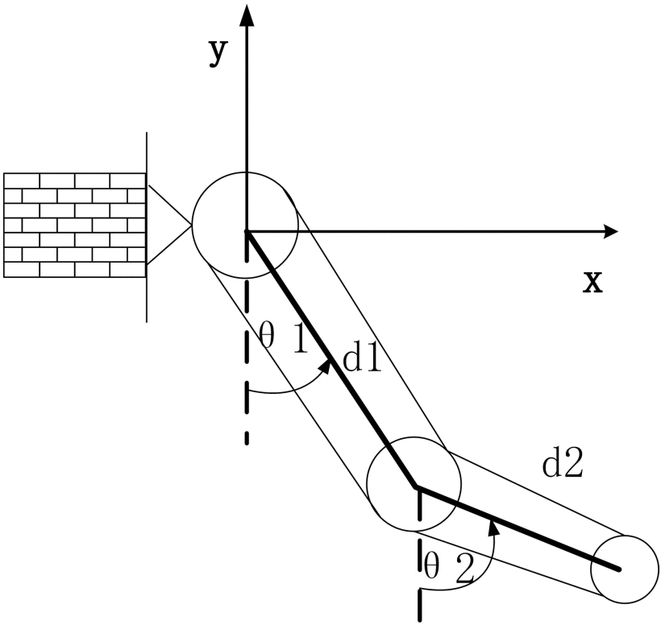
>
> 经过计算，小腿的动能和势能分别如Eq.32和Eq.33所示。
>
>$$\begin{align*} {K_{m1}} =& \frac{1}{2}{m_1}{v^2}\\ =& \frac{1}{2}{m_1}{({d_1}{{\dot{\theta }}_1}\cos {\theta _1})^2} + \frac{1}{2}{m_1}{({d_1}{{\dot{\theta }}_1}\sin {\theta _1})^2}\\ =& \frac{1}{2}{m_1}{({d_1}{{\dot{\theta }}_1})^2} \tag{32}\\ {P_{m1}} =& - {m_1}g{d_1}\cos {\theta _1} \tag{33} \end{align*}$$
>
>脚背的动能和势能可以表示为Eq.34和Eq.35。
>
>$$\begin{align*} {K_{m2}} =& \frac{1}{2}{m_2}{v^2}\\ =& \frac{1}{2}{m_2}{({d_1}{{\dot{\theta }}_1})^2} + \frac{1}{2}{m_2}{({d_2}({{\dot{\theta }}_1} + {{\dot{\theta }}_2}))^2}\\ & + {m_2}{d_1}{d_2}{{\dot{\theta }}_1}({{\dot{\theta }}_1} + {{\dot{\theta }}_2})\cos {\theta _2} \tag{34}\\ {P_{m2}} =& - {m_2}g{d_1}\cos {\theta _1} - {m_2}g{d_2}\cos ({\theta _1} + {\theta _2}) \tag{35} \end{align*}$$
>
>然后，系统的拉格朗日函数$L$表示在Eq.36中。
>
>$$\begin{equation*} L\ = \ K - P\ = {K_{m1}}\ + {K_{m2}} - \left({{P_{m1}} + {P_{m2}}} \right) \tag{36} \end{equation*}$$
>
>脚踝肌肉扭矩与关节动能和势能之间的关系可以通过将获得的$L$代入公式Eq.37来获得。
>
>$$\begin{equation*} {F_i}/{\tau _i} = \frac{d}{{dt}}\frac{{\partial L}}{{\partial {{\dot{\theta }}_i}}} - \frac{{\partial L}}{{\partial {\theta _i}}} \tag{37} \end{equation*}$$
>
>分别对$\theta_1$和$\theta_2$求导。在实验过程中，$\theta_1$固定在0°。足下垂患者的运动速度很慢，因此忽略了${\dot{\theta }_2}^2$这一项。因此，足背的惯性项和重力项如Eq.38所示。
>
>$$\begin{equation*} {T_2} = {m_2}\ d_2^2{\ddot{\theta }_2} + {m_2}g{d_2}\sin {\theta _2} \tag{38} \end{equation*}$$
>
>$m_2$是受试者脚部的重量。$d_2$是脚踝和脚的质心之间的距离。根据不同的个体来确定参数$m_1$、$m_2$、$d_1$、$d_2$。

### 实验验证——踝关节角度-力矩实验

> ?>这一部分为了证明Eq.13的正确性，单独找了一个受试者来验证。

> [!Note]
>
>另外还招募了一名志愿者来测量踝关节角度和扭矩数据。将实验数据与仿真结果进行对比，验证了拟合扭矩模型的有效性。实验中使用了Biodex System 4（美国Biodex）的扭矩传感器系统。它在等距和等速条件(equidistant and equivelocity conditions)下测量关节扭矩和角度信号。PC（i7-9700，16GB，SSD 512G）存储数据并进行相关数据分析。志愿者坐在可调节高度方向的匹配座位上。他们的脚踝与动力轴保持对齐。扭矩装置被穿戴，如下图所示。
>
>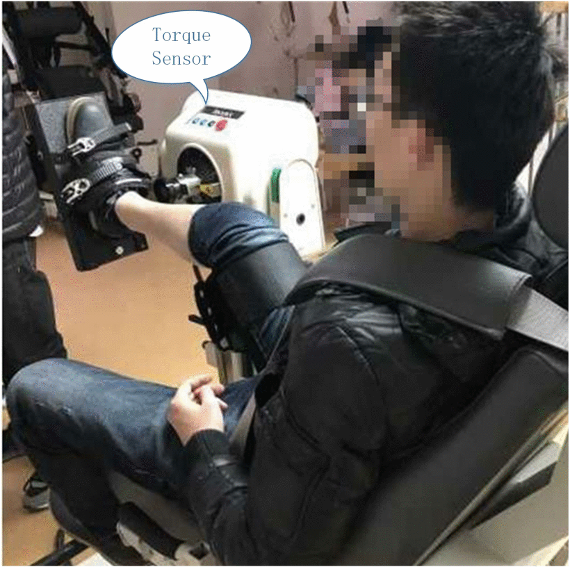
>
>严格按照仪器操作规程进行测量。志愿者被要求多次重复背伸跖屈的动作，以收集踝关节的位置和力矩数据。使用Matlab进行数据处理，对比实际测量和仿真结果。扭矩$\tau$和角度之间的关系和误差如下图所示。
>
>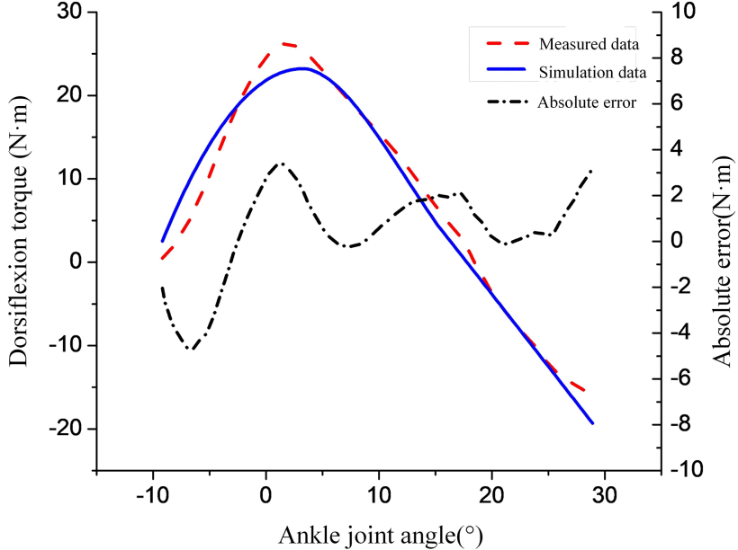
>
>上图显示了后退(backsliding)时踝关节角度和踝关节背屈扭矩之间的关系。实测数据趋势与仿真数据一致，总体误差范围为±5(N/m)，表明模型的可靠性。

### 实验验证——EKF算法的参数估计结果

> ?>这一部分需要注意的是辨识的参数是k1，k2，k3。同时，验证的过程还是挺有意思。

> [!Note] 
>
>实验平台由功能性电刺激器(MEDEL，MotionStim8)，姿势传感器(IMU形式Delsys，物理治疗电极(LT-1生理电极，厚度1mm，尺寸40mm×40mm)和PC(i7-9700，16GB，SSD 512G)组成。固定电刺激电流的幅度和频率为25 mA和25 Hz，脉冲宽度从50 μs到110 μs不等。受试者1的参数被选为实验对象，被馈送到伪随机多级(PRML)序列中。记录脚踝的输出角度响应。然后，从惯性项和重力项得到受试者1的模型状态方程。未知参数使用 EKF 算法进行识别。根据EKF算法在Matlab中制备M文件，并将实验数据作为识别数据导入。
>
>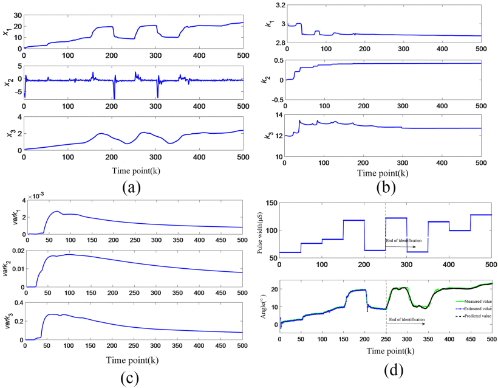
>
>状态变量根据EKF的步骤进行估计。算法收敛时状态变量和识别的未知参数是稳定的，提取的状态变量是识别的模型参数值。上图(a)显示了500个迭代数据点下的估计踝关节角度、踝关节角速度和激活状态。上图(b)显示了模型未知参数的识别结果。计算出的识别参数的方差如上图(c)所示。当识别的数据点达到 250 时，10 秒后，方差开始接近 0，证明参数开始收敛。当数据被识别为 250 个点时，EKF 观测校正功能终止。用最新的估计状态参数值预测电刺激的输入脉宽数据，当数据点为500时停止预测。EKF的预测结果如上图(d)所示。从时间点0到250的识别过程是EKF滤波器估计过程，它与实际的踝关节角度数据重叠，如上图(d)所示。250 点后，EKF 校正功能关闭。在时间点 250-500 提取预测角度。结果表明：预测角度的轨迹与实际角度的轨迹一致。但是，脉冲宽度的电平存在一定的误差。因此，进一步验证了模型的鲁棒性。通过改变输入电刺激脉冲宽度的类型和周期，对模型进行了进一步的验证和适应分析。

### 实验验证——模型适用性和稳定性测试

> ?>核心观点与说明

>[!Note] 设置输入电刺激的脉宽波形变化，即方波、正弦波、PRML序列和滤波随机噪声（FRN）序列，以进一步测试模型的适用性。FRN和PRML序列的变化周期分别为1秒和2秒。利用本研究建立的模型对踝关节角度进行预测，得到不同脉宽变化下的模型预测数据结果，如下图所示。
>
>
>
>计算模型预测角度和实际角度的均方根误差(RMSE)和归一化RMSE(NRMSE)，如表V所示。通过验证模型对不同输入电刺激参数的适用性，可以识别影响模型适用性的因素。将模型的仿真数据与不同个体的实际数据进行比较。计算实际角度和估计角度的RMSE和NRMSE以获得模型下每个人的数据验证结果，如表VI所示。每组数据重复10次。因此，计算RMSE和NRMSE的平均值和标准差。
>
>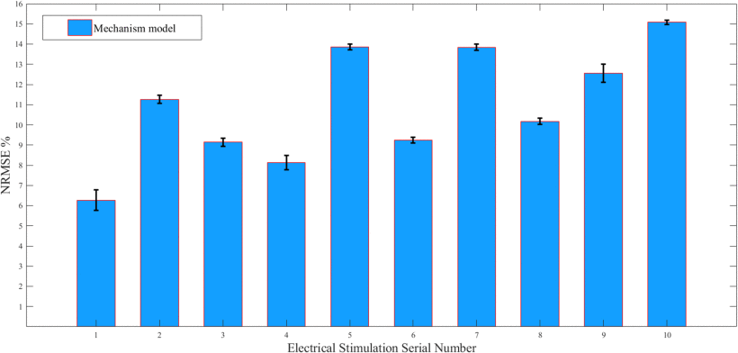
>
>为了验证模型的稳定性，将上述序列类型的10个不同序列随机输入到模型中，以计算其NRMSE。实验结果如图12所示。

### 讨论

> ?>核心观点与说明

> [!Note] A. EKF算法的讨论
>
> 图10表明，EKF算法能够从参数估计和预测结果中准确估计和预测踝关节的角度响应。可以在线识别的收敛时间约为10秒，表明预测时间变化的潜力很大。但是，EKF算法不容易收敛。因此，在正确的模型的基础上，必须反复调整状态参数的初始值以使其收敛。如果初始值偏离实际值，则收敛性受到影响，状态变量的背离可能会随之而来。
>
> B. 模型实验结果的讨论
>
> 根据生理和运动功能的特点，构建了基于Hill模型的FES踝关节肌肉骨骼模型。该模型是通过改变惯性和重力项根据每个人的差异形成的。因此，该模型可以轻松跟踪人体的生理变化，抵抗踝关节角度的滞后、时间变化和非线性。还可以减小模型的估计参数误差，有效预测踝关节角度的变化。如图12所示，对于不同的输入波形，肌肉骨骼模型的NRMSE值均小于15%。可以看出，模型是稳定的。
>
> 模型实验的验证结果分析表明，对于不同的输入波形，可以得到较好的估计，如表五所示。FRN的性能接近PRML。然而，持续时间为1秒和2秒变化的数据具有不同的刺激效果。持续时间为2 s变化的数据可以很好地跟踪踝关节运动特性，验证电刺激输入的脉宽变化。主要原因是踝关节系统的电刺激是一个缓慢的系统。1秒内的变化无法及时跟踪数据，误差大。该模型可以有效预测不同个体的生理功能变化，如表VI所示。对于不同个体，模型的NRMSE为11.93%±0.53%，RMSE为1.39°±0.26°。与[31]中的神经网络模型相比，其RMSE和NRMSE分别为2.78°±0.33°和23.70%±1.77%。本文提出的模型进一步减小了误差。因此，该模型具有良好的鲁棒性，并且模型的适用性不会因个体差异而受到影响。此外，受试者2的NRMSE和RMSE都很小，可能是因为该模型对体脂比高的受试者比对体脂比低的受试者更有效。然而，在这项工作中使用了健康的受试者。基于模型的良好性能，未来我们将使用2秒波形对更多患者群体进行临床试验研究。
>
> 

## 参考文献

`X. Zhang et al., "Dynamics Combined With Hill Model for Functional Electrical Stimulation Ankle Angle Prediction," in IEEE Journal of Biomedical and Health Informatics, vol. 27, no. 5, pp. 2186-2196, May 2023, doi: 10.1109/JBHI.2022.3158426.`
