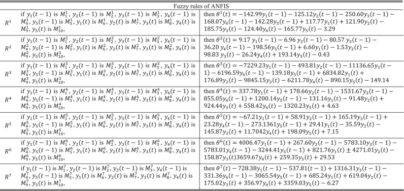

# 肌肉协同驱动的ANFIS方法预测连续膝关节运动

## 基本信息

| Paper Title | A Muscle Synergy-Driven ANFIS Approach to Predict Continuous Knee Joint Movement |
| :---------- | ------------------------------------------------------------ |
| 年份        | 2022                                                         |
| 作者        | Mingming Zhang 南方科技大学                                  |
| 状态        | **Done**                                                     |
| 期刊        | [IEEE Transactions on Fuzzy Systems](https://ieeexplore.ieee.org/xpl/RecentIssue.jsp?punumber=91) |

## 摘要

> [!tip|style:flat|label:摘要] 
>
> 连续运动预测在实现机器人外骨骼和矫形器的无缝控制方面发挥着重要作用。明确地对**表面肌电图（sEMG）的协调肌肉激活与人体肢体运动之间的关系**进行建模，为基于sEMG的人机界面提供了一条新的路径。我们提出了一种肌肉协同驱动的基于网络的**自适应模糊推理系统**（ANFIS）方法来预测连续的**膝关节运动**，而不是来自单个通道的数字特征，其中肌肉协同作用反映了运动控制信息，以协调肌肉激活以进行运动。四名人类受试者在以五种速度行走时参与了实验：2.0公里/小时、2.5公里/小时、3.0公里/小时、3.5公里/小时和4.0公里/小时。研究发现，获得的肌肉协同作用将肌肉激活与低维空间中的人体关节运动联系起来，并已进一步用于预测膝关节角度。所提方法**优于单个sEMG通道的常用数值特征**，平均**相关系数为0.92±0.05**。结果表明，肌肉协同驱动的ANFIS模型捕获了肌肉激活与膝关节运动之间的相关性，可用于估计连续关节角度。

## 创新点

!>**针对模糊推理的结构和参数辨识方面工作很细致**

!>**建立详细完整的肌肉协同驱动ANFIS模型，预测不同行走速度下的膝关节角度**

!>**协同系数进行了辨别，敏感性分析**

## 思维导图

提出的肌肉协同驱动的ANFIS方法框架由**表面肌电信号处理**、**肌肉协同提取**和**肌肉协同驱动的ANFIS模型**三部分组成。(A)对表面肌电信号进行去噪处理，从“表面肌电信号到肌肉激活模型”推导出肌肉的激活状态。(B)从肌肉激活曲线中提取肌肉协同效应以形成肌肉协同效应空间。(C)肌肉协同驱动的ANFIS模型用于从肌肉协同空间预测关节运动。

## 重点内容

### 背景介绍

> ?>  sEMG 信号可以用来做检测--》有成功的案例--》举例该算法的局限性--》介绍肌肉协同--》有成功的案例--》提出非线性性质

> [!Note]
>
> 已经开发了下肢外骨骼和矫形器，以协助人们在日常活动中运动[1]-[3]，并提高**病理康复**的恢复效果[4]，[5]。该领域的挑战之一是准确推断人类用户的运动意图，这是实现机器人外骨骼和矫形器**无缝控制**的基础。在可用的传感技术中，表面肌电图（sEMG）信号目前更可取，原因有两个。一方面，sEMG信号是由反映人们运动状态的肌肉收缩产生的[6]。另一方面，sEMG信号可以在实际物理运动之前检测运动意图，从而避免机器人应用的控制延迟[7]。
>
> sEMG信号已被广泛应用，以两种方式检测人体运动意图。一种是基于**分类**的方法，通常能够通过机器学习算法区分步态事件（脚跟着地、脚趾脱落等）和运动模式（步行、坡道上升/下降等）[7]-[9]。例如，Morbidoni等人提出了一种方法，从sEMG信号对脚跟撞击和脚趾离开时间进行二元分类和预测[7]。Liu等人使用sEMG和惯性测量单元（IMU）信号确定了一些被广泛研究的运动模式（水平地面行走，坡道上升/下降和楼梯上升/下降），他们还确定了不同运动模式之间的转换[9]。很明显，这些方法更适合触发控制，因为它们只能识别有限数量的离散运动状态。另一种方法是**连续估计运动变量**（关节角度、角速度等）。[10]-[12]。Chen等人提出了一个深度信念网络来估计连续的下肢关节角度[11]。Zhang等人还利用BP神经网络实现了下肢关节角度的连续估计[12]。在这种方法中，可以从sEMG信号中连续识别人类预期的运动轨迹，并用作机器人设备的控制命令。
>
> 通过机器学习算法对连续运动轨迹的现有识别方法通常遵循传统范式(conventional paradigm)，其中从收集的sEMG数据中计算一组数值特征，以捕获(capture )潜在的规律性和模式(patterns )[13]，[14]。但是，存在两个缺点。首先，从单个sEMG通道计算的数字特征对幅度消除、噪声和电极移位很敏感，这可能发生在辅助机器人的日常使用或穿脱[15]。其次，更重要的是，有人声称**传统范式可能经常失败**，因为它**没有反映导致观察到的肌肉激活的生理现象的知识**[16]。例如，在执行坐标任务时，通过使用数字特征，**不能将某些肌肉如何协同作用显式地建模为机器学习算法**[17]。上述这些限制阻碍了该方法向机器人应用和临床实践的过渡[18]-[20]。
>
> 在神经生理学中，肌肉协同作用是一组神经控制信息，揭示肌肉募集的协调[21]，[22]。肌肉协同作用是指调节多块肌肉激活的体质功能单元，它反映了不同肌肉之间运动单位在**宏观层面上共享(shared)的神经驱动**[23]。肌肉协同理论表明，运动系统通过肌肉协同作用的灵活组合直接启动运动[24]，[25]。
>
> 肌肉协同作用也已经广泛应用于机器人应用的运动意图检测[6]，[26]-[28]。对于基于分类的识别，Furui等人提出了一种基于肌肉协同的**运动判断方法**(motion determination method)，并成功实现了假手的仿生控制[6]。对于连续运动解码，Jiang等人预测了具有DOF肌肉协同作用的**手腕运动学**，并控制了一个虚拟物体，其中离线性能很差$R^2$的 39.9 ± 13.0%。但是，在线性能大大提高到93.9±5.45%有视觉反馈[29]。此外，Dwivedi等人从sEMG和运动学数据中提取肌肉协同效应和运动学协同作用，并使用**流形相关判断方法**预测手部运动，实现了$R^2$的 0.84± 0.05% [26]。然而，仅使用肌肉协同作用准确预测连续运动仍然是一个挑战。
>
> 肌肉激活和产生的运动在非线性性质(nonlinear nature)上高度相关。能够捕获(capture )非线性的算法更适合于这个问题集(problem set)来模拟肌肉激活与人体肢体运动之间的关系。基于不确定性的自适应模糊推理系统（ANFIS）[30]作为对具有不确定性的**非线性动力学进行建模**的强大工具，已成功应用于信号处理和时间序列预测[30]–[33]。此外，ANFIS还处理了模型可解释性，结构化知识表示和学习能力的优势。特别是，一些研究已经管理ANFIS识别不同的人体运动模式[34]，[35]并估计连续关节运动[36]，其中数字特征是从单个sEMG通道中提取的。
>
> 

### ANFIS模型-模型建立建模

> ?> 经典模糊推理过程

> [!Note] 
>
> ANFIS集成了神经网络的学习能力和模糊逻辑系统的知识表示能力[30]，可以用一组模糊规则[37]对复杂的非线性系统进行建模。本节开发了一个基于行走时 sEMG 数据的 ANFIS 模型。考虑到肌肉协同空间，我们使用肌肉协同驱动的ANFIS模型对膝关节运动进行建模。
>
> 以膝关节为例，利用规则数为*m*的模糊规则对其关节运动进行建模，形成具有**肌肉协同空间的肌肉协同驱动ANFIS模型**$Y \in  {\mathbb{R}^{k \times t}}$如下：
>
> $$\begin{equation*} \begin{array}{rl} {R^i}:&\,\text{if}\,{y_1}\left({t - 1} \right)\,\text{is}\,M_1^i,\,{y_2}\left({t - 1} \right)\,\text{is}\,M_2^i,\ \ldots,{y_j}\left({t - 1} \right)\,\\ &\text{is}\, M_j^i,{y_1}\left(t \right)\,\,\text{is}\ \,M_{j + 1}^i,\,{y_2}\left(t \right)\,\,\text{is}\,\,M_{j + 2}^i,\ \ldots,\ {y_j}\left(t \right) \, \text{is}\,M_{2j}^i\\ &\,\,\,\,\,\,\text{then}\,\,{\theta ^i}\ \left(t \right) = \lambda _1^i\ {y_1}\left({t - 1} \right) + \lambda _2^i{y_2}\left({t - 1} \right) + \cdots \\ &\,\,\,\,\,\,\,\,\,\,\,\,\,\,\,\, + \lambda _j^i{y_j}\left({t - 1} \right) + \ \lambda _{j + 1}^i{y_1}\left(t \right) + \lambda _{j + 2}^i{y_2}\left(t \right) + \cdots \\ &\,\,\,\,\,\,\,\,\,\,\,\,\,\,\,\,\, + \lambda _{2j}^i{y_j}\left(t \right) + {\xi ^i} \end{array} \tag{2} \end{equation*}$$
>
> ${R^i}({i\ = \ 1,\ 2, \ldots,\ m})$：ANFIS模型的第$i$条规则；$m$：模糊规则数目；${y_j}({t - 1})$和${y_j}({t})$：协同空间的输入；$\theta (n)$：膝关节角度是模型的输出；${\xi ^i}$：常数；
>
> ${z_l}\ ({l\ = \ 1,\ 2,\ \ldots,\ 2k})$：系统的输入；$\lambda _l^i$：结果参数(consequence parameter)；$k$：肌肉协同效应的数量；$M_l^i$：具有以下高斯隶属函数的第$l$个输入的第$i$个模糊子集：
> $$
> \begin{equation*}
> {\mu _{M_l^i}} = \ \exp \left[ { - \frac{{{{\left({{z_l} - c_l^i} \right)}^2}}}{{2{{\left({\sigma _l^i} \right)}^2}}}} \right],\left({l\ = \ 1,2, \ldots,2k} \right) \tag{3}
> \end{equation*}
> $$
>
> 其中，$c _l^i$和$\sigma _l^i$是隶属函数的中心和宽度，构成ANFIS的前提参数集(premise parameter sets)。
>
> 模糊系统(Eq.2)可以通过使用五层ANFIS[30]来实现。ANFIS的输出是膝关节的角运动，可以评估(evaluated)如下：
>
> $$
> \begin{array}{l}
> \theta \left( t \right) = \sum\limits_{i = 1}^m {\left[ {{{\bar \omega }^i} \cdot {\theta ^i}\left( t \right)} \right]}  = \sum\limits_{i = 1}^m {\left[ {{{\bar \omega }^i}\left( {\lambda _1^i{y_1}\left( {t - 1} \right) + \lambda _2^i{y_2}\left( {t - 1} \right)} \right.} \right.} \\+ \lambda _k^i{y_k}\left( {t - 1} \right) + \;\lambda _{k + 1}^i{y_1}\left( t \right) + \lambda _{k + 2}^i{y_2}\left( t \right) + \lambda _{2k}^i{y_k}\left( t \right) + \left. {\left. {{\xi ^i}} \right)} \right]
> \end{array} \tag{4}
> $$
>
> 其中
>
> $$
> \begin{align*}
> &{\bar{\omega }^i} = \frac{{{\omega ^i}}}{{\sum\nolimits_{i = 1}^m {{\omega ^i}} }} \tag{5}\\
> &{\omega ^i} = \prod\limits_{l = 1}^{2k} {{\mu _{M_l^i}}} . \tag{6}
> \end{align*}
> $$
>
> 从（Eq.3）到（Eq.6），可以使用ANFIS模型的去模糊化获得膝关节角度运动的预测，如（Eq.7）中所述。
> $$
> \begin{array}{l}
> \theta (t) = \left( {\sum\limits_{i = 1}^m {{\theta ^i}(t)\prod\limits_{l = 1}^{2k} {{\mu _{M_l^i}}} } } \right)/\left( {\sum\limits_{i = 1}^m {\prod\limits_{l = 1}^{2k} {{\mu _{M_l^i}}} } } \right)\\ = \frac{{\left( {\sum\nolimits_{i = 1}^m {{\theta ^i}(t) \cdot \exp \left[ { - \left( {\sum\nolimits_{i = 1}^{2k} {\frac{{{{\left( {{z_l} - c_l^i} \right)}^2}}}{{2{{(\sigma _l^i)}^2}}}} } \right)} \right]} } \right)}}{{\left( {\sum\nolimits_{i = 1}^m { \cdot \exp \left[ { - \left( {\sum\nolimits_{i = 1}^{2k} {\frac{{{{({z_l} - \sigma _l^i)}^2}}}{{2{{(\sigma _l^i)}^2}}}} } \right)} \right]} } \right)}}
> \end{array}\tag{7}
> $$
> 模糊规则数$m$、前提参数$c _l^i$和$\sigma _l^i$、结果参数$\lambda _l^i$和输入输出数据空间的偏差(deviation of input–output data space)对模型性能至关重要。
>

### ANFIS模型-模糊规则确定与参数初始化

> ?> 模糊规则推理标准过程

> [!Note] 
>
> 模糊规则的确定和ANFIS模型参数的初始化与模型性能和训练效率密切相关。因此，**采用减法聚类算法**(subtractive clustering algorithm)对输入输出数据空间进行划分，用于初始化模糊规则参数[38]、[39]。使用$Z$组数据样本$\{ {\mathbf{F}_1}, \ldots,{\mathbf{F}_p}, \ldots,{\mathbf{F}_z}\}$(${F_p} = {\rm{ }}[{y_j}(t - 1),{y_j}(t)]$,$j\ = \ 1,\ 2,\ \ldots,\ k$,$p\ = \ 1,\ 2,\ \ldots,\ Z$)的膝关节，减法聚类的步骤如下。
>
> - **第 1 步**：设置初始参数${\delta _a}$，这是聚类中心的有效邻域半径。
>
> - **第 2 步**：计算每个数据的以下密度指数$\mathbf{F}_p$:
>   $$
>   \begin{equation*}{D_p} = \sum\limits_{q = 1}^K {\exp \left[ { - \frac{{{{\left\| {{\mathrm{F}_p} - {\mathrm{F}_q}} \right\|}^2}}}{{{{\left({\frac{{{\delta _a}}}{2}} \right)}^2}}}} \right](p,q =1,2,\ldots,Z)} \tag{8}
>   \end{equation*}
>   $$
>
> - **第 3 步**：查找最大密度指数$D_{\text{max}1}^c$，获取第一个聚类中心${\mathbf{F}_{c1}} = {\mathbf{F}_p}\ |\max {D_p}$。
>
> - **第 4 步**：选择下一个邻域半径，调整密度指数
>   $$
>   \begin{equation*}D_p^c \Leftarrow D_p^c - D_{\text{max}1}^c\exp \left[ { - \frac{{{\mathbf{F}_p} - {\mathbf{F}_q}^2}}{{{{\left({{\delta _a}/2} \right)}^2}}}} \right] \tag{9} \end{equation*}
>   $$
>
> - **第 5 步**：重复步骤 3 和 4，直到$D_p^c\ \leq \ \tau$($\tau$是一个小的正常数）得到第$i$个($i\ = \ 2,\ \ldots,\ m$) 群集中心，其中$m$($m < Z$)是聚类中心的数量。
>
> - **第 6 步**：将当前密度指数与上一次密度指数进行比较
>   $$
>   \begin{equation*}\frac{{{D_{\text{max}q}}}}{{{D_{\text{max}q - 1}}}} < \theta . \tag{10} \end{equation*}
>   $$
>   若 （Eq.10） 不成立，请转到步骤 3 并继续搜索群集中心。否则，请退出该过程。
>
>   聚类数量$m$确定模糊规则的数量；前提参数$c _l^i$和$\sigma _l^i$分别由聚类中心和半径确定。
>
> 

### ANFIS模型-参数优化

> ?> 将每个参数的推导过程写出来，一看就是自己做的，增加可信度。

> [!Note] 
>
> 为了优化模型参数，采用递归最小二乘法训练结果参数$\lambda _l^i$，并利用反向传播方法训练前提参数$c _l^i$和$\sigma _l^i$[30]。
>
> **递归最小二乘：**拟合前提参数$c _l^i$和$\sigma _l^i$，并用前向传播的膝关节数据训练结果参数$\lambda _l^i$，即
> $$
> \begin{align*} \lambda _l^i\left({t + 1} \right)& \!=\! \lambda _l^i\ \left(t \right) \!+\! {K^L}\left({t + 1} \right)\left[ {\theta \left({t + 1} \right) \!-\! {\varphi ^T}\left({t + 1} \right)\lambda _l^i\left(t \right)} \right]\\ {K^L}\left({t + 1} \right)& = \frac{{{P^L}\left(t \right)\varphi \left({t + 1} \right)}}{{1 + {\varphi ^T}\left({t + 1} \right){P^L}\left(t \right)\varphi \left({t + 1} \right)}}\\ {P^L}\left({t + 1} \right)& = \left[ {I - {K^L}\left({t + 1} \right){\varphi ^T}\left({t + 1} \right)} \right]\ {P^L}\left(t \right) \tag{11} \end{align*}
> $$
> 其中，${P^L}\ (0) = {q^L}\ \mathbf{I}\ \in \ {\mathbb{R}^{2n \times 2n}}$，$ {q^L}$是一个很大的正数(largely positive number)，通常取值在10e4和10e10之间，本文中取10e6。
>
> **反向传播：**拟合结果参数$\lambda _l^i$，并使用反向传播学习算法来训练前提参数$c _l^i$和$\sigma _l^i$如下：
> $$
> \begin{align*} c_l^i\left({t + 1} \right)\ = & c_l^i\left(t \right) - {\alpha _c}\frac{{\partial E}}{{\partial c_l^i}}\\ =& c_l^i\left(t \right) - {\alpha _c}\frac{{\partial E}}{{\partial \theta \left(t \right)}} \cdot \frac{{\partial \theta \left(t \right)}}{{\partial {\mu _{M_l^i}}}} \cdot \frac{{\partial {\mu _{M_l^i}}}}{{\partial c_l^i}}\\ =& c_l^i\left(t \right) - {\alpha _c}\left({\theta \left(t \right) - \hat{\theta }\left(t \right)} \right) \cdot \left({\theta \left(t \right) - \hat{\theta }\left(t \right)} \right)\\ &.{{\bar{\omega }}^i}\left(t \right) \cdot \frac{{{z_l}\left(t \right) - c_l^i\left(t \right)}}{{{{\left({\sigma _l^i\left(t \right)} \right)}^2}}} \tag{12}\\ \sigma _l^i\left({t + 1} \right)\ =& \sigma _l^i\left(t \right) - {\alpha _\sigma }\frac{{\partial E}}{{\partial \sigma _l^i}}\\ =& \sigma _l^i\left(t \right) - {\alpha _\sigma }\frac{{\partial E}}{{\partial \theta \left(t \right)}} \cdot \frac{{\partial \theta \left(t \right)}}{{\partial {\mu _{M_l^i}}}} \cdot \frac{{\partial {\mu _{M_l^i}}}}{{\partial \sigma _l^i}}\\ =& \sigma _l^i\left(t \right) - {\alpha _\sigma }\left({\theta \left(t \right) - \hat{\theta }\left(t \right)} \right) \cdot \left({\theta \left(t \right) - \hat{\theta }\left(t \right)} \right)\\ &.{{\bar{\omega }}^i}\left(t \right) \cdot \frac{{{z_l}\left(t \right) - c_l^i\left(t \right)}}{{{{\left({\sigma _l^i\left(t \right)} \right)}^2}}} \tag{13} \end{align*}
> $$
> 其中，$\theta (t)$是模型的当前关节角，并且$\hat{\theta }(t)$表示所需(desired )的关节角度。均方根成本函数$E\ = \frac{1}{2}\ {({\theta (t) - \hat{\theta }(t)})^2}$可以保证找到全局最优。${\alpha _c }$和${\alpha _\sigma }$分别是隶属函数的中心和宽度参数的学习率。
>
> 

### ANFIS模型-实验模型配置

> ?> 这个实验配置主要是同一个建模方法不同输入值。

> [!Note] 
>
> 来自步行速度会话的所有五项试验的数据点被合并在一起并搅乱(shuffled)。具有肌肉协同作用空间和时域特征（MAV、WL 和 MAV+WL）的 ANFIS 建模每个会话总共有 36000 个样本数据。在建模中，**我们还集成了时间$t$和$t−1$的数据作为输入，形成了ANFIS模型。**
>
> **肌肉协同驱动ANFIS模型**
>
> 肌肉协同空间的维度为${\mathbb{R}^{k \times 36000}}$。80%的数据集（约28800个数据点）用于提取模糊规则。数据集的其余部分（大约 7200 个数据点）用作测试数据。综合(Integrating)$t$和$t−1$处的肌肉协同效应，建模过程和测试中输入的维度分别为${\mathbb{R}^{2k \times 28799}}$和${\mathbb{R}^{2k \times 7199}}$。
>
> **基于时域特征的ANFIS模型**
>
> MAV和WL是从八个肌肉通道中提取的，它们的维度是${\mathbb{R}^{8 \times 36000}}$。对于MAV或WL的输入，80%的数据集（约28800个数据点）用于对模糊规则进行建模。数据集的其余部分（大约 7200 个数据点）用作验证数据。综合(Integrating) $t$和$t−1$处的肌肉协同效应，建模过程和测试中输入的维度为$\mathbb{R}^{16×28799}$和$\mathbb{R}^{16×7199}$分别。对于MAV+WL的输入，建模过程和测试中输入的维度分别为$\mathbb{R}^{24×28799}$和$\mathbb{R}^{32×7199}$。
>

### ANFIS模型-最终结果

> ?>这个结果做的很好，一眼就可以看出区别，通过表格罗列公式很棒。

> [!Note] 
>
> 为了模拟肌肉协同作用驱动的ANFIS，五个提取的肌肉协同作用的信息在$t−1$和$t$被安排为输入变量，即$y_1(t−1),y_2(t−1),y_3(t−1),y_4(t−1),y_5(t−1),y_1(t),y_2(t),y_3(t),y_4(t)$和$y_5(t)$，预测膝盖角度$\theta (t)$。根据模糊规则确定和模型初始化方案，使用$10×28799$建模数据提取模糊规则数量$m$作为 7 并分配输入的成员函数。然后，训练算法学习ANFIS模型的参数。输入肌肉协同作用的隶属函数$y_1(t−1),y_2(t−1),y_3(t−1),y_4(t−1),y_5(t−1),y_1(t),y_2(t),y_3(t),y_4(t)$和$y_5(t)$，优化的肌肉协同作用驱动的ANFIS模型如下图所示。
>
> 
>
> 提取的模糊规则和前提参数$c _l^i$和$\sigma _l^i$，如下表所示。
>
> 
>
> 

### 肌肉激活模型

> ?> 经典模型，没有任何新东西。参数值的选取可以学习。

> [!Note] 
>
> **肌肉激活反映了肌肉产生的主动力水平**。首先，需要将原始的表面肌电信号预处理成一种形式。用表面肌电信号-肌肉激活模型代替表面肌电信号延迟线(delay lines)来考虑机电延迟(EMD)和激活动力学的影响。
>
> 使用四阶巴特沃兹滤波器对原始sEMG信号在[20, 450] Hz范围内进行带通滤波。然后对每个sEMG通道进行整流，使用相应整流sEMG的总峰值归一化，通过4阶巴特沃兹滤波器滤波4 Hz低通，并进行**下采样**以匹配运动数据的频率。
>
> 使用二阶模型过滤器(filter)来模拟sEMG与肌肉激活之间的关系[41]，[42]。在这项研究中，我们使用$e(t)$来表示时间$t$处的经预处理的表面肌电信号
> $$
> \begin{equation*}
> u\left(t \right)\ = \ \alpha e\left({t - d} \right) - {\beta _1}u\left({t - 1} \right) - {\beta _2}u\left({t - 2} \right) \tag{17}
> \end{equation*}
> $$
> 其中$u(t)$是时间$t$的神经激活。在该模型中，$\alpha$、$\beta _1$和$\beta _2$是滤波器的递归系数，$d$是EMD参数。通过使$\alpha$、$\beta _1$和$\beta _2$遵守以下约束来保证过滤器的稳定性：
> $$
> \begin{align*}
> &{\beta _1} = {\gamma _1}\ + {\gamma _2} \tag{18}\\
> &{\beta _2} = {\gamma _1}\ \cdot {\gamma _2} \tag{19}\\
> &\left| {{\gamma _1}} \right| < 1,\left| {{\gamma _2}} \right| < 1 \tag{20}\\
> &\alpha - {\beta _1} - \ {\beta _2} = \ 1. \tag{21}
> \end{align*}
> $$
> 神经激活$u(t)$和肌肉激活$a(t)$的关系在[43]中提出，即，
> $$
> \begin{equation*}
> a\left(t \right)\ = \frac{{{e^{A \cdot u\left(t \right)}} - 1}}{{{e^A} - 1}}\ \tag{22}
> \end{equation*}
> $$
> 
> 其中A是处理肌肉激活特征的非线性参数。**基于研究[43]参数设置如下**：$d = 10 ms$， $\gamma _1=−0.033$，$\gamma _2=−0.019$，$A =−3$。

### 性能评估

> ?> 这一部分可以参考，实验结果要比较三方面。

> [!Note] 
>
> 估计膝盖角度的质量使用**四个指标进行评估**，即均方根误差 (root mean square error, RMSE)、相关系数(correlation coefficient, $\rho$)、*R* 平方 (R-square, $R^2$)，以及步态周期的推理计算时间。公式如下：
> $$
> \begin{equation*}
> {\rm{RMSE = }}\sqrt {\frac{{\sum\nolimits_{i = 1}^N {{{\left({{\theta _{\mathrm{M}}} - {\theta _{\text{EST}}}} \right)}^2}} }}{N}} \tag{24}
> \end{equation*}
> $$
> 其中，最分别是测量和估计的膝盖角度。$N$是验证数据集中的数据样本数。RMSE 指标(index)给出所有平方误差均值的平方根index。
> $$
> \begin{equation*}
> \rho \ = \frac{{\text{Cov}\left({{\theta _{{\rm{M\ }}}},{\theta _{\text{EST}}}} \right)}}{{\sqrt {D\left({{\theta _{{\rm{M\ }}}}} \right)} \sqrt {D\left({{\theta _{\text{EST}}}} \right)} }}\ \tag{25}
> \end{equation*}
> $$
> 其中，$\text{Cov}(\cdot)$是$\theta _\mathrm{M}$和$\theta _\text{EST}$的协方差。$D(\cdot)$是标准差。相关系数反映了估计结果与测量值之间的相关性强度。
> $$
> \begin{align*}
> {R^2} &= 1 - \frac{{\mathrm{S}{\mathrm{S}_{{\rm{res\ }}}}}}{{\mathrm{S}{\mathrm{S}_{{\rm{tot\ }}}}}} \tag{26}\\
> \mathrm{S}\,{\mathrm{S}{\text{res}}} &= {\sum\limits_{i = 1}^N {\left({{\theta _{\text{EST}}} - \overline {{\theta _M}} } \right)} ^2} \tag{27}\\
> \mathrm{S}\,{\mathrm{S}_{\text{tot}}} &= \sum\limits_{i = 1}^N {{{\left({{\theta _{\mathrm{M}}} - \overline {{\theta _M}} } \right)}^2}} \tag{28}
> \end{align*}
> $$
> 其中，$S Sres$是测量值和估计值之间的总和回归误差。$S Stot$是测量值和测量值平均值之间的总误差之和平方。$R^2$可以反映模型的质量。其值范围为 [0, 1]。指数越接近1，模型对实测结果的解释能力越强。
>
> 进行了**单因素方差分析(one-way ANOVA)和Kruskal-Wallis检验**，以提供0.05的显着水平下的统计分析。

### 膝关节预测结果

> ?>实验结果图片不用很多，但是要全一些。

> [!Note] 
>
> 下图是所提方法分别与常用时域特征WL、MAV和WL+MAV的预测结果。在 ANFIS 模型中使用 MAV、WL 和 MAV+WL 时，估计角度和目标角度之间存在更大的跟踪偏差。所提出的肌肉协同驱动ANFIS模型取得了良好的跟踪性能和更高的预测精度。
>
> 
>
> 
>
> 
>

### 同行比较

> ?>这一部分写的不多，但是要对比也是要最起码有四条。

> [!Note] 
>
> 与相关研究相比，提出的方法的性能总结下图中。如文献[13]和[14]中的研究利用传感器融合技术(表面肌电信号和其他传感数据)来预测膝关节角度，这比仅利用表面肌电信号性能更好。此外，研究[10]和[11]只从表面肌电信号中提取特征，以获得肌肉协同和低维空间等神经信息来预测关节运动。然后，研究将低维协同空间与关节运动联系起来，**以实现最先进的性能(achieve state-of-the-art performance)**。因此，利用表面肌电信号中的神经信息来检测人体的运动意图可能在未来值得进一步关注。它还为无缝人机交互提供了一条可行的途径，有助于将这种方法过渡到机器人应用和临床实践。
>
> 

## 参考文献

W. Zhong, X. Fu and M. Zhang, "A Muscle Synergy-Driven ANFIS Approach to Predict Continuous Knee Joint Movement," in *IEEE Transactions on Fuzzy Systems*, vol. 30, no. 6, pp. 1553-1563, June 2022, doi: 10.1109/TFUZZ.2022.3158727.
