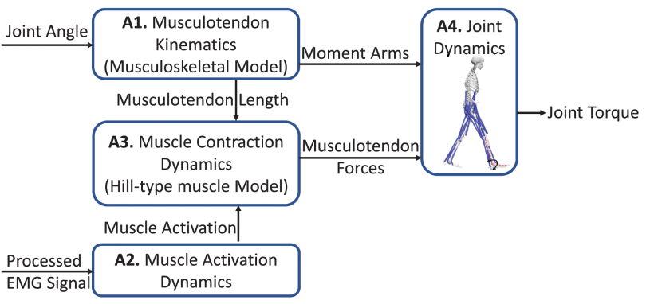
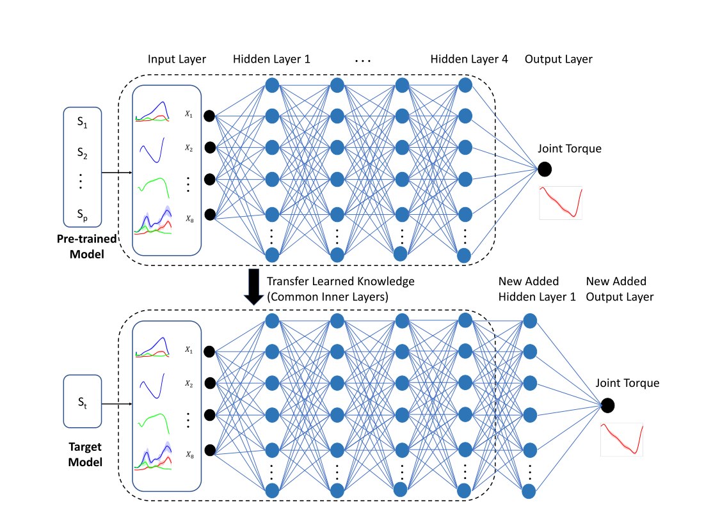
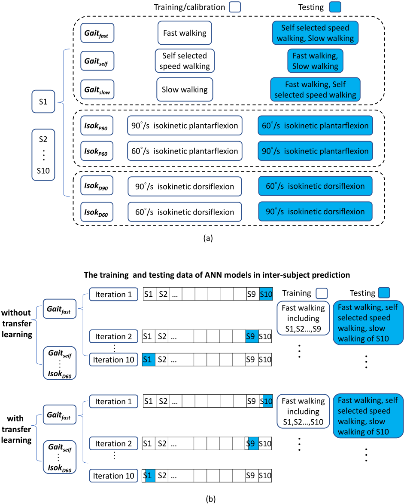
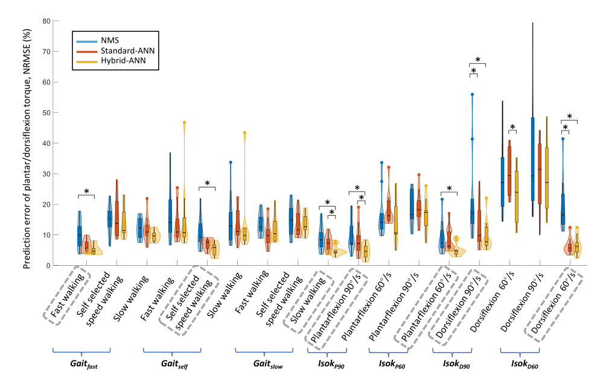
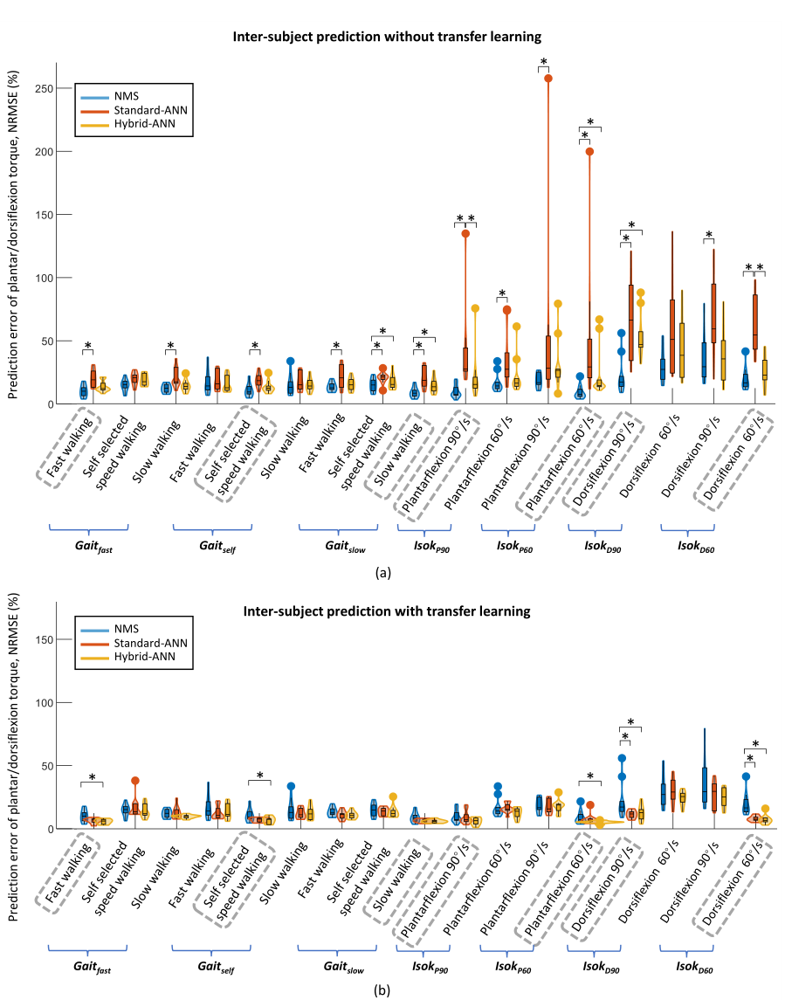

# 基于NMS求解器的神经网络模型和迁移学习的踝关节扭矩预测

## 基本信息

| Paper Title | Ankle Joint Torque Prediction Using an NMS Solver Informed-ANN Model and Transfer Learning |
| :---------- | ------------------------------------------------------------ |
| 年份        | 2022                                                         |
| 作者        | Longbin Zhang 瑞典斯德哥尔摩皇家理工学院                     |
| 状态        | 待开始                                                       |
| 期刊        | [IEEE Journal of Biomedical and Health Informatics](https://ieeexplore.ieee.org/xpl/RecentIssue.jsp?punumber=6221020) |

## 摘要

> [!tip|style:flat|label:摘要] 
>
> 在这项工作中，我们将神经肌肉骨骼（NMS）求解器知情人工神经网络（solver-informed artificial neural network, HYBRID-ANN）模型与基于关节角度和肌肉肌电图信号的迁移学习相结合，预测了踝关节扭矩。混合人工神经网络是一种增强的人工神经网络，具有两种功能：（1）**实验测量 - 肌肉信号和关节角度**，以及（2）从底层NMS求解器中提取的信息性物理特征，例如单个肌肉力和关节扭矩。在受试者内和受试者间测试中研究了混合ANN模型在扭矩预测中的精度，并与基线模型（NMS和标准ANN）进行了比较。对于每个预测模型，使用来自不同速度的步态和等速踝背/足跖运动的数据研究了七个不同的案例。此外，我们在受试者间模型中集成了一种迁移学习方法，**通过将先前参与者的学习知识转移到新的参与者来提高关节扭矩预测的准确性，这在训练数据有限时可能很有用**。我们的结果表明，通过将信息NMS特征集成到标准ANN模型中可以获得更好的准确性，特别是在受试者间的情况下;总体而言，混合ANN模型预测关节扭矩的精度高于基线模型，在采用迁移学习技术后的主体间预测中最为明显。我们展示了**在不同预测场景中**将基于物理的NMS和标准ANN模型与迁移学习技术相结合的潜力。该程序在诸如通过结合用户的生理关节扭矩来设计按需辅助外骨骼控制策略等应用中具有很大的前景。

## 创新点

## 思维导图

## 重点内容

### 背景介绍

> ?> 扭矩的重要性-->基于物理的方法有缺陷-->人工神经网络有好处-->人工神经网络也有缺点-->迁移学习来避免缺点

> [!Note] 
>
> 已广泛研究了外骨骼在运动障碍患者中恢复失去的运动功能的潜力[1]–[3]。在外骨骼辅助康复训练期间，用户的积极参与对于刺激神经肌肉恢复至关重要[4]，[5]。因此，外骨骼控制策略最重要的特征之一是外骨骼是否能够提供适当的辅助扭矩以适应用户剩余的肌肉功能[6]。近年来，**将用户的扭矩能力纳入辅助设计**的外骨骼控制策略的研究呈指数级增长，因为这种方法鼓励用户积极参与促进运动恢复[7]。
>
> 在预测关节扭矩的方法中，基于物理(physics)的方法是常见的。例如，Durandau等人。[8] 研究了一种实时肌电图（EMG）驱动的神经肌肉骨骼（NMS）模型，以建立完整人类从肌电图信号到机械关节扭矩产生的转换。他们可以同时可靠地计算13个肌腱单元(muscle-tendon units)的力和三个关节力矩（膝伸肌/屈肌、踝跖屈肌/背屈肌和距下旋前肌/旋后肌）。EMG驱动的NMS模型通常需要领域知识(domain knowledge)来明确建模变量之间的关系，例如**，肌肉主动力和被动力-长度关系**、**肌肉力-速度关系**和**关节角度-肌肉肌腱运动学**关系。通常，在复杂的步骤中设置/校准模型可能是费力且耗时的。此外，基于物理的NMS模型**仅对关节动力学进行粗略估计**，EMG的质量可能会受到串扰和传感器放置的影响。其他研究，如肌电图辅助的NMS模型，已经进行了研究，以通过结合肌腱参数的优化进一步提高模型的预测精度，从而产生更好地跟踪测量关节扭矩的估计肌肉兴奋[9]，[10]。然而，在实时预测中获得调整后的参数仍然是一个具有挑战性的问题。
>
> 人工神经网络（ANN）由于其功能和近似精度，经常被用于预测关节扭矩。ANN具有多层计算单元，通过将每个节点视为人工神经元来模拟大脑中的人类神经元突触系统，从而创建处理复杂和非线性信息的能力[11]–[14]。Pena等人[15]使用ANN作为NMS模型的替代方法，以估计**主动膝矫形器控制策略**中肌电和扭矩之间的映射。他们发现，与NMS模型相比，基于神经网络的模型具有更高的预测精度。人工神经网络无疑被认为是识别变量与输出之间关系和/或搜索数据中已建立模式的有力工具。然而，ANN是一个黑箱模型，**没有变量之间潜在机制的概念，因此可能无法为训练分布之外的数据提供可靠的预测**[16]，特别是当训练数据的数量和变化受到限制时。为了利用神经网络的优势，最近的一些研究将神经网络纳入了基于物理的模型中，用于各种应用，例如增强模型的预测能力和**促进神经肌肉的发育骨骼建模**。Zhang等人[17]构建了一个神经网络，该网络具有从光谱重建求解器中提取的信息特征，以对胶体量子点光谱仪的光谱进行建模。由于求解器告知的特征，他们在混合模型中表现出更好的重建精度和鲁棒性。在最近的一篇综述论文中，Saxby等人[18]提出了**如何将基于物理的模拟与来自大数据的机器学习方法相结合，以促进(facilitate)神经肌肉骨骼建模**，并建议结合个性化神经肌肉骨骼模型特征和大数据/机器学习方法进行未来研究。受上述工作的启发，我们最近将NMS模型的信息特征纳入了步态和等速运动期间踝关节扭矩预测的标准ANN中[19]。我们的受试者内预测结果表明，组合模型总体预测关节扭矩优于NMS和标准ANN，证明了将基于物理的NMS解算器的信息特征纳入标准ANN的好处。然而，模型在学科间预测中的可推广性尚未得到进一步分析。
>
> 肢体关节扭矩预测中的中间体模型(Inter-subject model)生成通常是一项具有挑战性的任务。NMS模型必须首先通过**单独的实验测试进行校准**，以获得个性化的参数，例如，**最佳纤维长度、最大等距力和腱松弛长度**；那么个性化模型可以用于估计肌肉力和关节扭矩。因此，人们可以预期NMS模型在对象间预测中的泛化较差。相反，在给定足够的训练数据和足够的训练的情况下，**神经网络的可推广性主要取决于网络的大小**。然而，当训练数据有限时，当数据在训练分布之外时，可概括性(generalizability)通常会面临性能下降[16]。
>
> 最近，迁移学习已被采用来提高泛化性(generalizability)，尤其是在数据有限的情况下[20]，[21]。Jayaram等人[22]提出了一种脑机接口中的转移学习框架，该框架可以应用于基于脑电图信号的任何期望的时空特征空间。他们的结果表明，这种方法在处理 session-to-session (inter-session) 和   subject-to-subject (inter-subject)变异性(variability)方面优于其他可比方法。Karri等人[23]微调了预训练的卷积神经网络GoogLeNet（ImageNet数据库上的模型），以提高其识别光学相干断层扫描图像和病理学的预测能力。这些作者说明了GoogleLeNet对图像分类的适应性，以使用较少的数据进行训练，从而更快地收敛。**通过利用预先训练的神经网络对先前经验/数据的知识，可以使用相对较少的样本获得具有良好性能的新神经网络**。因此，转移学习技术是一种潜在的方法，可以提高跨学科模型中关节扭矩预测的通用性。
>
> 这项工作的目的是研究NMS求解器告知的ANN(NMS solver-informed ANN)在受试者内和受试者间预测中的踝关节扭矩预测准确性。由于某些受试者的训练数据往往有限，我们采用了迁移学习技术，通过使用从以前的经验中获得的知识，特别是针对主题间预测，进一步提高模型的预测精度。

### NMS Model

> ?> 运动学组件实现肌肉利弊和肌肉长度；动力学组件实现力矩预测；这一部分给出了需要标定的参数
> 

> [!Note] 
>
> 本研究中使用了由Pizzolato等人[10]开发的开源肌电驱动的NMS模型（CEINMS），包括肌肉肌腱运动学、肌肉收缩动力学、肌肉激活动力学和关节动力学（图2）[33]。
>
> 肌肉激活动力学组件利用收集的EMG计算肌肉激活。EMG $e(t)$和神经激活$u(t)$之间的关系可以公式化为等式（1）[34]。
>
> $$u(t) = \alpha  \cdot e(t - \tau ) - {\beta _1} \cdot u(t - 1) - {\beta _2} \cdot u(t - 1)   Eq.(1)$$
>
> 其中$\alpha$是肌肉增益参数；$ {\beta _1}$和$ {\beta _2}$是递归参数；$\alpha, {\beta _1}, {\beta _2}$被约束为以下关系以获得稳定的解[10][34][35]：
> ${\beta _1} = {C_1} + {C_2},{\beta _2} = {C_1} \cdot {C_2}$, where $\alpha  - {\beta _1} - {\beta _2} = 1$。$\tau$是机电延迟(electromechanical delay)。 肌肉激活$a(t)$和神经激活之间的关系可以公式化为等式（2）：
> $$a(t) = \frac{{{e^{Bu(t)}} - 1}}{{{e^B} - 1}} Eq.(2)$$
> 其中B是形状因子(shape factor)[9]、[35]。
> 肌肉收缩动力学组件通过基于希尔的肌肉模型计算肌肉肌力。每个肌肉肌腱单位（MTU）力$F$可以公式化为等式（3）。
> $$F=F_0^m\left[F_a(l) \cdot F_v(v) \cdot a+F_p(l)+d_a \cdot v\right] \cos (\psi) Eq.(3)$$
> $F_0^m$：肌肉最大等长力；$l$：纤维长度(纤维长度)；$v$：纤维收缩速度；$F_a(l)$：主动力-长度关系；$F_p(l)$：被动力-长度关系；$ F_v(v)$：力-速度关系；$d_a$：肌肉阻尼参数；$\psi$：纤维三角角(fiber pennation angle)。
>
> **肌肉肌腱运动学组件**计算肌肉肌腱单元的力臂和肌肉肌腱长度。最后，通过**关节动力学组件**预测关节扭矩。
>
> 在NMS模型**校准**过程中，对每个参与者进行受试者特定MTU参数识别。这些参数，包括**最佳纤维长度**、**肌腱松弛长度**、**形状系数B**、**强度系数**以及系数**C1和C2**，通过在校准过程中最小化估计和测量的关节扭矩之间的误差来进行细化。校准参数和**边界条件列表基于Pizzolato等人的建议**[10]。每个MTU的最佳纤维长度$l_m^0$和肌腱松弛长度$l_t^s$限制在默认值的±15%以内。形状因子$B$被限制在(−3,0)。系数$C_1$和$C_2$在(−1,1)。力量系数被限制在（0.5,2.5），以**衡量肌肉最大等长力**。
>
> 

### 迁移学习

> ?>核心观点与说明

> [!Note] 
>
> 在受试者间预测中，两个ANN模型都采用了转移学习技术，通过使用从先前经验/受试者（S1、S2、…、Sp）获得的知识/信息预训练模型，并将获得的知识转移给新参与者，从而学习结构相似性如下图。我们从预训练模型中提取除输出层之外的层，然后将它们共享给目标对象（St）的模型。我们在**目标模型中添加了一个新的隐藏层和一个新输出层**；然后，利用来自新参与者的数据/信息，**训练两个添加层的权重**，同时**微调**其他层的权重。
>
> 
>

### 实验设计

> ?>主要是三个方法，两个测试项目，进行了三次实验。NMS、ANN和TLANN三种方法；受试者内预测和受试者间预测两个项目

> [!Note] 
>
> 下图，(a)是受试者内(intra-subject)预测中七种不同情况下NMS和ANN模型的训练/校准和测试数据；以及(b)在受试者间(inter-subject)预测中七种不同情况下的ANN模型的训练和测试数据。
>
> **受试者内预测：**对于每种情况，使用不同的运动来校准NMS模型或训练ANN模型。通过分别使用来自每个运动的数据来校准/训练模型，并分别针对每个用户（S1、S2、…、S10）以不同速度对相同类型的运动进行测试。----同一个人，预测不同项目的准确率。
>
> **无迁移学习的受试者间预测：**针对除一个受试者外的多个受试对象的每个运动训练模型（不使用交叉验证方法），然后对剩余新受试者的相同类型运动进行测试，然后对每个受试者进行迭代。-----同一个项目，不同的人的准确率。
>
> **带迁移学习的受试者间预测：**模型针对除一个用户外的多个用户的每个动作进行预训练，并共享给具有共同结构的新用户。然后，我们使用来自新参与者相同运动的数据（即来自新参与者的更少数据）重新训练模型，并在新对象的不同速度下对相同类型的运动进行测试，然后对每个对象进行迭代。-----同一个项目，不同的人之间的准确率。
>
> 

### 超参数优化方法

> ?> 给出了调整和微调的学习率

> [!Note] 
>
> 我们使用“从粗到细”随机搜索[37]方法来确定ANN模型的超参数。在训练过程中，损失函数是估计和实际踝关节扭矩之间的均方误差（mse）。使用的批次大小为20。选择具有零偏差初始值的Xavier权重。选择两个隐藏层用于受试者内预测，选择四个隐藏层进行受试者间预测。每个隐藏层包括十个具有tanh激活功能的神经元。选择Adam优化器（学习率为10e−3). 对于迁移学习技术，调整学习率为10−e4，使用10e−5用于微调。迭代4000个周期，当损失在连续200个周期内没有减少时，我们通过使用提前停止技术来获得最佳模型。

### 实验结果

> ?> 内容

> [!Note] 
>
> **受试者内预测**
>
> 总体而言，与NMS和标准 ANN相比，在混合ANN模型中观察到较小的NRMSE如下图。
>
> 
>
> 在所有校准/训练的运动中，混合神经网络的预测精度显著高于NMS。（自选快走：$p=0.02$，快走：$p=0.02$，慢走：$p=0.05$，等速足底屈伸90°/s：$p=0.04$，等速足底屈伸60°/s：$p=0.02$，等速背伸90°/s：$p=0.02$，等速后伸60°/s:p=0.02）。在测试的运动中，与NMS相比，混合ANN通常具有更好的扭矩预测精度，只有一个例外，如图7所示。在Gaitself情况下，混合ANN模型对一名受试者快慢行走的预测精度低于NMS模型，如上图所示。
>
> 与标准神经网络相比，混合神经网络并不总是表现出优越的预测精度。值得注意的是，与其他两个模型相比，在一些测试运动中，标准ANN模型的预测扭矩与实际扭矩的一致性更差，例如Gaitself情况下的慢走、IsokP90情况下的等速足底弯曲60°/s和IsokP60情况下的等速足底屈伸90°/s。**NMS模型估计的扭矩轨迹有时在循环开始时显示出偏移，而测量扭矩中不存在该偏移。在ANN模型预测的扭矩中未观察到这种偏移。**
>
> **受试者间预测**
>
> （a） 在没有转移学习的情况下，总的来说，ANN模型的扭矩预测精度比特定于受试者的NMS模型差，如下图，其中混合ANN的预测精度高于标准ANN。在所有经校准/训练的运动中，与NMS相比，标准ANN的预测精度明显较差。（慢走：$p=0.02$，自选快走：$p=0.02$，快走：$p=0.02$，等速足底屈伸90°/s：$p=0.02$；等速足部屈伸60°/s：$p=0.02$；等速背屈90°/s：$p=0.03$；等速背屈60°/s：$p=0.02$）。**在测试的运动中，标准神经网络通常比NMS和混合神经网络模型具有更差的预测精度。**
>
> 
>
> （b） 总体而言，在转移学习中，两个ANN模型的预测精度都得到了显著提高，其中标准ANN在某些运动中的精度比其他两个模型差，例如，在自选行走速度Gaitfast情况下，等速跖屈60°/s IsokP 90情况和等速跖屈90°/s IskP 60情况。
>
> 在Gaitfast、Gaitself和Gaitslow情况下，混合ANN模型总体上优于其他两个模型（如上图所示）。与NMS模型相比，在相同的训练/校准运动中发现了显著更高的预测精度，例如在快走（$p=0.03$）和自选速度行走（$p=0.02$）中，在慢走（$p=0.11$）中，预测精度略高，但并不显著。值得注意的是，在Gaitself的情况下，在测试的慢走中出现了标准ANN模型与实际扭矩一致的最差情况。当使用IsokP90和IsokP60进行训练/校准时，混合ANN模型在所有等速足底屈曲运动中具有最高的预测精度。与NMS相比，在相同的训练/校准等速足底屈曲60°/s（$p=0.02$）中发现了显著性，而在90°/s（$p=0.07$）中，尽管没有显著性，但在一定程度上更好。
>
> 在IsokD90和IsokD60情况中，在相同的训练/校准运动中，混合ANN的预测精度明显高于NMS（90°/s：$p=0.02$，60°/s：$p=0.02$），在测试的等速背屈运动中，虽然没有显著性差异，但预测精度稍好。总体而言，ANN模型通常比NMS模型表现更好。

### 标题

> ?> 内容

> [!Note] 

### 标题

> ?> 内容

> [!Note] 

## 参考文献
